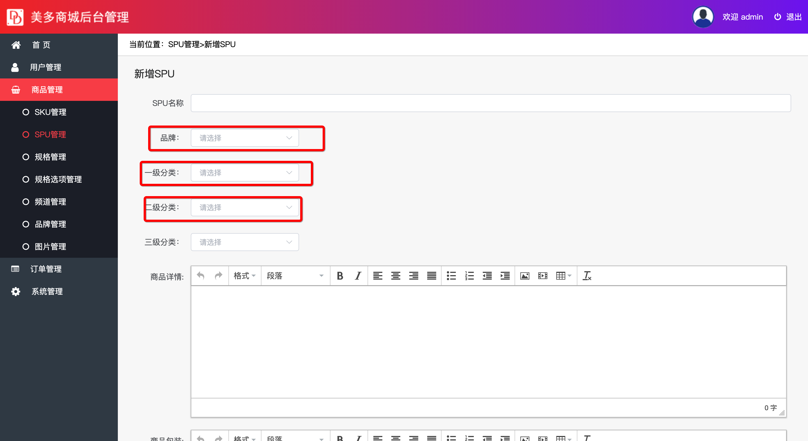

##  保存SPU表数据

在保存数据之前我们需要先获取品牌名称和分类信息



### 1、获取品牌信息

####接口分析

**请求方式**： GET  ` /meiduo_admin/goods/brands/simple`

**请求参数**： 通过请求头传递jwt token数据。

**返回数据**：  JSON

```json
 [
        {
            "id": 1,
            "name": "Apple"
        },
        {
            "id": 2,
            "name": "华为（HUAWEI）"
        }
    ]
```

| 返回值 | 类型 | 是否必须 | 说明         |
| ------ | ---- | -------- | ------------ |
| Id     | int  | 是       | 商品品牌id   |
| name   | 数组 | 是       | 商品品牌名称 |


### 后端实现

```python
class SPUBrandView(ListAPIView):
    """
        获取SPU表的品牌信息
    """
    serializer_class = BrandsSerizliser
    queryset = Brand.objects.all()


```

序列化器的定义

```python
class SPUBrandsSerizliser(serializers.ModelSerializer):
    """
        SPU表品牌序列化器
    """
    class Meta:
        model = Brand
        fields = "__all__"
```


### 2、获取一级分类信息

#### 接口分析

**请求方式**： GET   `meiduo_admin/goods/channel/categories/`

**请求参数**： 通过请求头传递jwt token数据。

**返回数据**：  JSON

```json
 [
        {
            "id": "一级分类id",
            "name": "一级分类名称"
        },
        ...
    ]
```

| 返回值 | 类型 | 是否必须 | 说明         |
| ------ | ---- | -------- | ------------ |
| Id     | int  | 是       | 一级分类ID   |
| name   | 数组 | 是       | 一级分类名称 |

#### 后端实现

``` python
class ChannelCategorysView(ListAPIView):
    """
            获取spu一级分类
    """
    serializer_class = CategorysSerizliser
    queryset = GoodsCategory.objects.filter(parent=None)  # parent=None表示一级分类信息
```

定义序列化器

``` python
class CategorysSerizliser(serializers.ModelSerializer):
    """
        SPU表分类信息获取序列化器
    """
    class Meta:
        model=GoodsCategory
        fields="__all__"
```


### 3、获取二级和三级分类

#### 接口分析

**请求方式**： GET   `/meiduo_admin/goods/channel/categories/(?P<pk>\d+)/`

**请求参数**： 通过请求头传递jwt token数据。

在路径中传递当前分类商品id

**返回数据**：  JSON

```json
 [
        {
            "id": "当前分类id",
            "name": "当前分类名称"
        },
        ...
    ]
```

| 返回值 | 类型 | 是否必须 | 说明     |
| ------ | ---- | -------- | -------- |
| Id     | int  | 是       | 分类id   |
| name   | Str  | 是       | 分类名称 |

####后端实现

``` python
class ChannelCategoryView(ListAPIView):
    """
        获取spu二级和三级分类
    """
    serializer_class = CategorysSerizliser  # 使用前面已经定义过的分类序列化器
    
    def get_queryset(self):
      	pk=self.kwargs['pk']
        return GoodsCategory.objects.filter(parent=pk) # 通过上级分类id 获取下级分类数据
```


### 4、保存SPU数据

#### 接口分析

**请求方式**：POST   `meiduo_admin/goods/`

**请求参数**： 通过请求头传递jwt token数据。

| 参数         | 类型 | 是否必须 | 说明       |
| ------------ | ---- | -------- | ---------- |
| name         | str  | 是       | SPU名称    |
| brand_id     | int  | 是       | 商品SPU ID |
| category1_id | str  | 是       | 商品副标题 |
| category2_id | int  | 是       | 三级分类ID |
| category3_id | int  | 是       | 价格       |
| desc_detail  | str  | 是       | 进价       |
| desc_pack    | str  | 是       | 市场价     |
| desc_service | str  | 是       | 库存       |

**返回数据**：  JSON

``` json
 {
        "id": "商品SPU ID",
        "name": "SPU名称",
        "brand": "品牌名称",
        "brand_id": "品牌id",
        "category1_id": "一级分类id",
        "category2_id": "二级分类id",
        "category3_id": "三级分类id",
        "sales": "SPU商品销量",
        "comments": "SPU商品评论量",
        "desc_detail": "商品详情",
        "desc_pack": "商品包装",
        "desc_service": "售后服务"
   }
```

| 参数         | 类型 | 是否必须 | 说明          |
| ------------ | ---- | -------- | ------------- |
| id           | Int  | 是       | 商品SPU ID    |
| name         | Str  | 是       | 商品SPU 名称  |
| brand        | str  | 是       | 品牌名称      |
| brand_id     | int  | 是       | 品牌id        |
| category1_id | int  | 是       | 一级分类id    |
| category2_id | int  | 是       | 二级分类id    |
| category3_id | int  | 是       | 三级分类id    |
| sales        | int  | 是       | SPU商品销量   |
| comments     | int  | 是       | SPU商品评论量 |
| desc_detail  | str  | 是       | 商品详情      |
| desc_pack    | str  | 是       | 商品包装      |
| desc_service | str  | 是       | 售后服务      |

后端实现

``` python
# SPUGoodsView继承的是ModelViewSet 所以保存逻辑还是使用同一个类视图
class SPUGoodsView(ModelViewSet):
    """
        SPU表
    """
    serializer_class = SPUGoodsSerialzier
    queryset = SPU.objects.all()
    pagination_class = PageNum
```

