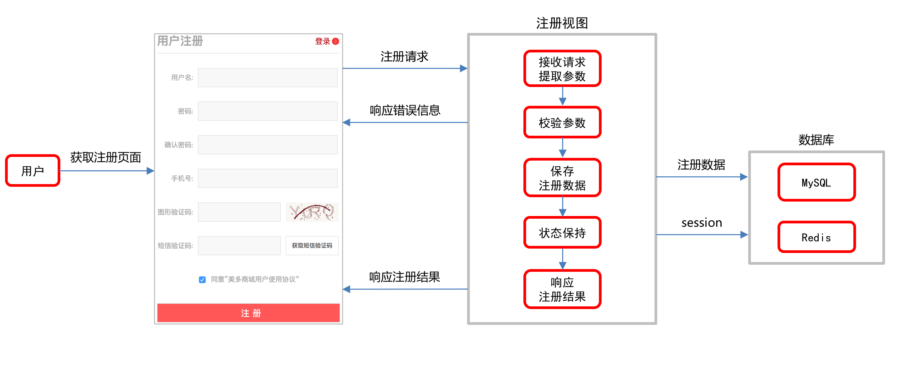

## Django第一天 （项目介绍）

- 创建自己的gitee仓库和django虚拟环境并集成到pycharm中 —— (代码仓库名meiduo_project)。

  - 注意点：忽略 .idea
  - Ctrl + K ：commit changes

- 创建项目工程——工程名：meiduo_mall。

- 创建开发环境的配置文件。——dev.py  settings模块下

- > 注：运行一个单独的py文件，而该py文件中需要使用Django中的东西，则需要在py文件的开头添加以下代码：

  ```python
  # 设置Django运行所依赖的环境变量
  import os
  if not os.environ.get('DJANGO_SETTINGS_MODULE'):
    os.environ.setdefault('DJANGO_SETTINGS_MODULE', 'drf_demo.settings')
    #os.environ.setdefault("DJANGO_SETTINGS_MODULE", "meiduo_mall.settings.dev") 如果更改了setting的位置 写成这样
  
  # 让Django进行一次初始化
  import django
  django.setup()
  ```

- 新建一个包：setting 包含

   - dev.py(开发环境配置文件)   --- manager.py 修改启动文件

- - 项目架构：
  - 前后端不分离的开发模式，是为了提高搜索引擎排名，即SEO特别是首页，详情页和列表页。

  - 搜索引擎爬虫请求到的页面数据就是渲染好的完整页面，搜索引擎可以直接解析建立索引。

- 页面需要整体刷新：我们会选择使用Jinja2模板引擎来实现。

- 页面需要局部刷新：我们会选择使用Vue.js来实现。

## Django第二天（项目配置）

- 配置jinja2模板

  > 要求：能够知道基本使用和为什么用jinja2即可
  >
  > 由于django默认模板引擎功能不齐全,速度慢，所以我们也可以在Django中使用jinja2, jinja2宣称比django默认模板引擎快10-20倍。
  >
  > Django主流的第三方APP基本上也都同时支持Django默认模板及jinja2，所以要用jinja2也不会有多少障碍。

  ```python
  # 1、安装jinja2
  pip install jinja2
  
  # 2、添加TEMPLATES配置.  jinja2.Jinja2
  TEMPLATES = [
      {
          'BACKEND': 'django.template.backends.jinja2.Jinja2',
          'DIRS': [os.path.join(BASE_DIR, "templates")],
          'APP_DIRS': True,
          'OPTIONS': {
              'environment': 'meiduo_mall.utils.jinja2_env.environment',
              'context_processors': [
                  'django.template.context_processors.debug',
                  'django.template.context_processors.request',
                  'django.contrib.auth.context_processors.auth',
                  'django.contrib.messages.context_processors.messages',
              ],
          },
      },
  ]
  
  # 3、添加jinja2_env（'environment': 'meiduo_mall.utils.jinja2_env.environment',）
  
  from django.contrib.staticfiles.storage import staticfiles_storage
  from django.urls import reverse
  from jinja2 import Environment
  def environment(**options):
  
      env = Environment(**options)
  
      env.globals.update({
          # {{ static('path/to/company-logo.png') }}   {{ url('admin:index') }}
          'static': staticfiles_storage.url,
          'url': reverse,
      })
  
      return env
  
  ```

- 配置mysql

  > 要求：能够知道为什么要使用PyMySQL扩展包即可
  >
  > orm引擎操作数据库，得有一个驱动程序mysqldb，因为MySQLdb只适用于Python2.x的版本，Python3.x的版本中使用PyMySQL替代MySQLdb，初始化为mysqldb，orm就能识别了

  ```python
  # 0、pip install pymysql
  # 1、mysql终端创建数据库，并新建mysql用户
    $ create database meiduo charset=utf8;
    $ create user itheima identified by '123456';
    $ grant all on meiduo.* to 'itheima'@'%';
    $ flush privileges;
  # 2、添加DATABASES配置
  DATABASES = {
      'default': {
          'ENGINE': 'django.db.backends.mysql', # 数据库引擎
          'HOST': '192.168.78.130', # 数据库主机
          'PORT': 3306, # 数据库端口
          'USER': 'nanjing', # 数据库用户名
          'PASSWORD': '123456', # 数据库用户密码
          'NAME': 'meiduo' # 数据库名字
      },
  }
  # 3、安装PyMySQL扩展包 (在加载meiduo_mall的__init__.py文件下)
  from pymysql import install_as_MySQLdb
  install_as_MySQLdb()
  ```

- 配置redis  

  > 要求：知道为什么用redis存储session
  >
  > 使用Redis数据库存储缓存数据或者状态保持数据，收货地址，登录注册，购物车数据，浏览记录都需要缓存性能极高，存储到内存中的，Redis支持数据的持久化，丰富的数据类型等等

  ```python
  # 1、安装django-redis扩展
  pip install django-redis
  # 2、配置CACHES
  CACHES = {
      "default": {
          "BACKEND": "django_redis.cache.RedisCache",
          "LOCATION": "redis://192.168.78.130:6379/0",
          "OPTIONS": {
              "CLIENT_CLASS": "django_redis.client.DefaultClient",
          }
      },
      "session": {
          "BACKEND": "django_redis.cache.RedisCache",
          "LOCATION": "redis://192.168.78.130:6379/1",
          "OPTIONS": {
              "CLIENT_CLASS": "django_redis.client.DefaultClient",
          }
      }
  }
  # 3、配置SESSION_ENGINE和SESSION_CACHE_ALIAS
  
  SESSION_ENGINE = "django.contrib.sessions.backends.cache"
  SESSION_CACHE_ALIAS = "session"
  ```

- 配置日志

  > 要求：知道日志的等级，以及日志的应用场景和作用

  - 配置日志（百度即可）
  - 创建logs文件夹（注意创建的位置）
  - git管理logs文件（.gitkeep）

- 配置静态文件

  > 要求：明白STATIC_URL和STATICFILES_DIRS代表什么
  >
  > - STATIC_URL：静态路由
  > - STATICFILES_DIRS：静态文件的路径

  - 添加static文件夹（在发的第一天的课程资料里）
  - 添加STATICFILES_DIRS

  ```python
  STATIC_URL = '/static/'
  # 静态文件存放的路径
  STATICFILES_DIRS = [os.path.join(BASE_DIR, "static")]
  ```

- **创建用户子应用 **

  > 要求：明白为什么要把子应用放在apps下。
  >
  > 方便统一管理，9-10个子应用
  >
  > ​            自己尝试使用sys.path查看导包路径

  - python ../../manage.py startapp users
  - 追加导包路径

  ```python
  BASE_DIR = os.path.dirname(os.path.dirname(os.path.abspath(__file__)))
  
  # 增加导包路径
  sys.path.insert(0, BASE_DIR)
  sys.path.insert(0, os.path.join(BASE_DIR, "apps"))
  ```

- **展示注册页面**   （重点）

  > 要求：明白urls寻址流程，明白namespace和name的作用
  >
  > 方便反向解析的 重定向用到

  - 配置总urls
  - 配置应用中的urls
  - 在views中写入视图函数，render页面

- **用户模型类**     （重点）

  > 要求：明白为什么要使用django自带的认证系统
  >
  > Django认证系统包含的内容
  >
  > - 用户：**用户模型类**、用户认证。
  > - 权限：标识一个用户是否可以做一个特定的任务，MIS系统常用到。
  > - 组：对多个具有相同权限的用户进行统一管理，MIS系统常用到。
  > - 密码：一个可配置的密码哈希系统，设置密码、密码校验。
  >
  > 1. Django自带**用户认证系统**，**核心就是User对象**，并封装了一系列可用的方法和属性。
  >
  > 2. Django用户认证系统包含了一系列对用户的操作，比如：模型类，认证（auth），权限，分组，密码处理等。
  >
  > 3. Django用户认证系统中的用户模型类可以自定义，继承自**AbstractUser**。
  >
  > 4. 节省开发的时间和周期，
  >
  > 5. 自定义模型类（集成AbstractUser）：自己需要扩充一些djang中没有的字段，本项目扩展mobile字段
  >
  > 6. 迁移模型类的时候不要盲目迁移，否则会迁移子应用auth中的 AUTH_USER_MODEL = 'auth.User',而不是迁移子应用模型类（AUTH_USER_MODEL = 'users.User'）
  >
  >    在使用django创建工程的时候，那些默认的子应用（admin，auth等等），已经自动帮我们创建了迁移文件。

  - ##### auth：

    - 子应用中 auth 封装了整个认证的模型  site-packages-----django----contrib---auth---models.py    AbstractUser( )提供 字段、注册、登录方法
    - login、logout 在`django.contrib.auth.__init__.py`文件中
    - from django.contrib.auth import login
      - login(requset,user)
      - logiout(requset)

  - 创建用户(注册用户，保存用户数据)的方法

    ```python
    from django.contrib.auth.models import AbstractUser
    user = User.objects.create_user(username, email, password, **extra_fields)
    ```
  - 用户认证(用户登录)的方法 位置：django.contrib.auth.backends.ModelBackend。

    ```python
    from django.contrib.auth import authenticate
    user = authenticate(username=username, password=password, **kwargs)
    ```
  - 自定义模型类（集成AbstractUser）

  ```python
  from django.db import models
  from django.contrib.auth.models import AbstractUser
  
  class User(AbstractUser):
  
      mobile = models.CharField(max_length=11, unique=True, verbose_name="手机号")
  
      class Meta:
          db_table = "tb_user"
          verbose_name = "用户"
          verbose_name_plural = verbose_name # 复数形式
  
      def __str__(self):
          return self.username
  ```

  - 添加 **AUTH_USER_MODEL = 'users.User'，**阅读源代码：'django.conf.global_settings‘，Django用户模型类是通过全局配置项 **AUTH_USER_MODEL** 决定的

   ```python
  # AUTH_USER_MODEL = '应用名.模型类名'
  # 指定本项目自定义的用户模型类
  AUTH_USER_MODEL = 'users.User'
   ```

  - 生成迁移文件

  - 执行迁移

  ```shell
  python manage.py makemigrations
  python manage.py migration
  ```

- **用户注册业务逻辑分析**     （重点）

  > 要求：使用自己话术说出流程
  >
  > 用户获取注册界面(get)，用户发送注册请求，后端接收请求，并在请求报文中拿到注册数据（用户名、密码等），把这些参数进行校验，如果有错，响应错误信息403，如果没有错误，保存注册数据，到mysql，然后进行状态保持，缓存session数据，放在redis 1号库，如果注册完后，响应注册结果

  

- **注册接口定义**       （重点）

  > **请求方式**

  | 选项         | 方案       |
  | ------------ | ---------- |
  | **请求方法** | POST       |
  | **请求地址** | /register/ |

  > **2.请求参数：表单参数**

  | 参数名        | 类型   | 是否必传 | 说明             |
  | ------------- | ------ | -------- | ---------------- |
  | **username**  | string | 是       | 用户名           |
  | **password**  | string | 是       | 密码             |
  | **password2** | string | 是       | 确认密码         |
  | **mobile**    | string | 是       | 手机号           |
  | **sms_code**  | string | 是       | 短信验证码       |
  | **allow**     | string | 是       | 是否同意用户协议 |

  > **3.响应结果：HTML**
  >
  > - `register.html`

  | 响应结果     | 响应内容     |
  | ------------ | ------------ |
  | **注册失败** | 响应错误提示 |
  | **注册成功** | 重定向到首页 |

- 前端向后端索取数据时使用get
- 前端向后端发送隐私数据，新增数据post，发送注册数据的时候
- 修改后端数据put
- 删除后端数据delete
- 实线局部刷新 ajax请求

