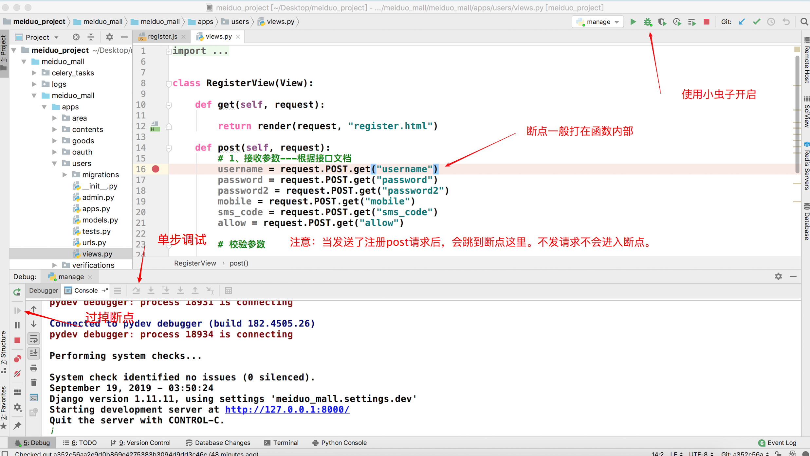
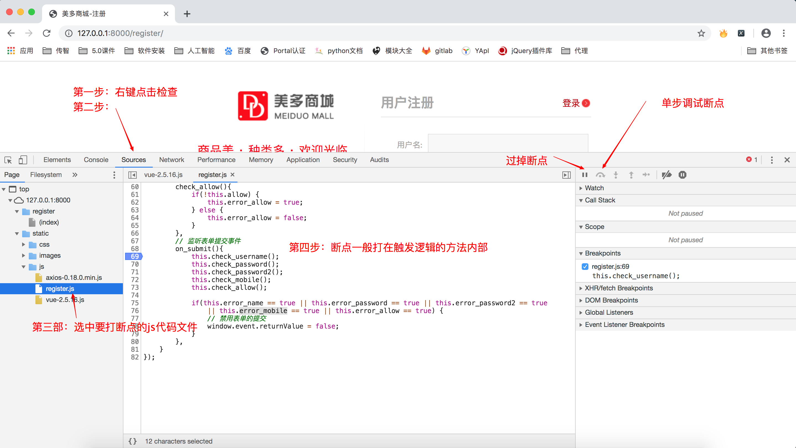
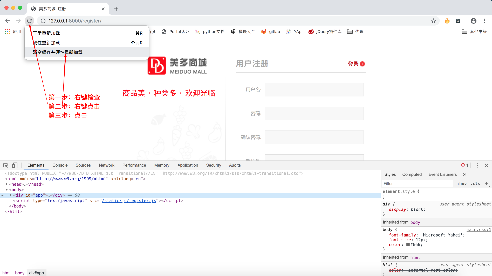

## Django第三天（注册前后端）

#### （一）注册前端逻辑

- html绑定变量和事件

  - 什么叫双向绑定的数据？js,html也要绑定。
    - 1、绑定表单数据
    - 2、绑定对应data数据。填入表单数据的时候，控制台能得到数据，并且在data里面填入数据，表单里面也能得到数据
  - 一、输入的数据：v-model（双向绑定表单数据）写在data之中
  - 二、鼠标数据焦点：@ 绑定事件，对应method方法
    - @blur（失去焦点事件）, @change（checkbox选择事件，选择框）, @submit（表单提交事件）
    - v-cloak  (vue渲染页面的时候，先加载数据再渲染界面，数据加载不出来，不渲染界面，避免变量名一闪而过)
  - 三、校验的结果是否展示：v-show（标签是否显示，TRUE:display:none；FALSE: display:block）
  - [[   ]]   （Vue接收html中的数据）
  - 隐藏域 {{  csrf_input  }}  jinja2的模板语法
  - {{ static('静态文件相对路径' )}}          {{ url('路由的命名空间') }}

- js绑定变量和事件

  - 加载vue和axios框架

  ```html
  <script type="text/javascript" src="{{ static('js/vue-2.5.16.js') }}"></script>
  <script type="text/javascript" src="{{ static('js/axios-0.18.0.min.js') }}"></script>
  # 导入的顺序不能错
  ```

  - 加载register.js代码

  ```html
  {# 一般放在最后一个body标签上面 #}
  <script type="text/javascript" src="{{ static("js/register.js") }}"></script>
  ```

  - 改变vue渲染变量的语法

  ```js
  delimiters: ['[[', ']]'],
  ```

  - 快速查找文件的快捷键
    - shift 双击两次（输入文件名）
  - 填充register.js代码

- ```js
  let vm = new Vue({
      el: '#app',
      // 修改Vue读取变量的语法
      delimiters: ['[[', ']]'],
      data: {
          username: '',
          password: '',
          password2: '',
          mobile: '',
          allow: '',
  
          error_name: false,
          error_password: false,
          error_password2: false,
          error_mobile: false,
          error_allow: false,
  
          error_name_message: '',
          error_mobile_message: '',
      },
      methods: {
          // 校验用户名
          // 通过js代码控制html标签
          check_username(){
              let re = /^[a-zA-Z0-9_-]{5,20}$/;
              if (re.test(this.username)) {
                  this.error_name = false;
              } else {
                  this.error_name_message = '请输入5-20个字符的用户名';
                  this.error_name = true;
              }
          },
          // 校验密码
          check_password(){
              let re = /^[0-9A-Za-z]{8,20}$/;
              if (re.test(this.password)) {
                  this.error_password = false;
              } else {
                  this.error_password = true;
              }
          },
          // 校验确认密码
          check_password2(){
              if(this.password != this.password2) {
                  this.error_password2 = true;
              } else {
                  this.error_password2 = false;
              }
          },
          // 校验手机号
          check_mobile(){
              let re = /^1[3-9]\d{9}$/;
              if(re.test(this.mobile)) {
                  this.error_mobile = false;
              } else {
                  this.error_mobile_message = '您输入的手机号格式不正确';
                  this.error_mobile = true;
              }
          },
          // 校验是否勾选协议
          check_allow(){
              if(!this.allow) {
                  this.error_allow = true;
              } else {
                  this.error_allow = false;
              }
          },
          // 监听表单提交事件
          on_submit(){
              this.check_username();
              this.check_password();
              this.check_password2();
              this.check_mobile();
              this.check_allow();
  
              if(this.error_name == true || this.error_password == true || this.error_password2 == true
                  || this.error_mobile == true || this.error_allow == true) {
                  // 禁用表单的提交
                  window.event.returnValue = false;
              }
          },
      }
  });
  ```


#### （二）注册后端逻辑

- 接收参数

  - 后端断点的设置

    

  - 前端断点设置

    

  - 重新加载js代码的快捷方式

    

  - 接收注册表单参数

    ```python
    class RegisterView(View):
    
        def get(self, request):
    
            return render(request, "register.html")
    
        def post(self, request):
            # 1、接收参数---根据接口文档
            username = request.POST.get("username")
            password = request.POST.get("password")
            password2 = request.POST.get("password2")
            mobile = request.POST.get("mobile")
            sms_code = request.POST.get("sms_code")
            allow = request.POST.get("allow")
    ```

- 校验参数

  - 内置方法：all([])

    ```python
    # 只要列表中有一个元素不存在，放回False
    In [1]: data_list = ["", "111", "2222"]                                                                                                
    In [2]: all(data_list)                                                                                                                 
    Out[2]: False
    In [3]: data_list = ["1111", "111", "2222"]                                                                                            
    In [4]: all(data_list)                                                                                                                 
    Out[4]: True
    ```

  - 内置方法：any([])

    ```python
    # 只要列表中有一个元素存在，返回True
    In [5]: data_list = ["111", "", ""]
    In [6]: any(data_list)                                                                                                                 
    Out[6]: True
    In [7]: data_list = ["", "", ""]                                                                                                       
    In [8]: any(data_list)                                                                                                                 
    Out[8]: False
    ```

  - 先整体后局部

    ```python
      if not all([username, password, password2, mobile, allow]):
          # HttpResponseForbiddens是HttpResponse的子类
        	return HttpResponseForbidden('缺少必传参数')
      # 判断用户名是否是5-20个字符
      if not re.match(r'^[a-zA-Z0-9_-]{5,20}$', username):
        	return HttpResponseForbidden('请输入5-20个字符的用户名')
      # 判断密码是否是8-20个数字
      if not re.match(r'^[0-9A-Za-z]{8,20}$', password):
        	return HttpResponseForbidden('请输入8-20位的密码')
      # 判断两次密码是否一致
      if password != password2:
        	return HttpResponseForbidden('两次输入的密码不一致')
      # 判断手机号是否合法
      if not re.match(r'^1[3-9]\d{9}$', mobile):
        	return HttpResponseForbidden('请输入正确的手机号码')
      # 判断是否勾选用户协议
      if allow != 'on':
        	return HttpResponseForbidden('请勾选用户协议')
        
      # 提示：这里校验的参数，前端已经校验过，如果此时参数还是出错，说明该请求是非正常渠道发送的，所以直接禁止本次请求。
    ```

- 保存数据

  - 导包报错问题

    ```python
    # sys.path.insert(0, os.path.join(BASE_DIR, "apps"))
    # 设置导包路径，只是python环境知道你去哪里找users，但是pycharm不知道。
    # 如果想让pycharm知道，需要右键点击apps，选中mark Directory as，选择Source Root即可解决
    from users.models import User
    ```

  - **kwargs讲解（扩展知识）

    ```python
    save_data = {
      "username": username,
      "mobile": mobile,
      "password": password
    }  # kwargs等价于字典
    # **save_data将字典解包：username=username, mobile=mobile, password=password
    ```

  - create_user源码解析

    ```python
    def _create_user(self, username, email, password, **extra_fields):
      """
            Creates and saves a User with the given username, email and password.
            """
      if not username:
        raise ValueError('The given username must be set')
        email = self.normalize_email(email)
        username = self.model.normalize_username(username)
        # user = User(username=username, email=email, **extra_fields)
        user = self.model(username=username, email=email, **extra_fields)
        # 将我们输入的111111111密码进行加密
        user.set_password(password)
        user.save(using=self._db)
        return user
    ```

  - 创建用户实现

    ```python
    try:
      User.objects.create_user(username=username, mobile=mobile, password=password)
    except DatabaseError as e: # from django.db import DatabaseError
        print(e)
    	return render(request, "register.html", {"register_error": "注册失败"})
    
    ```

- 返回响应（重定向到首页）

  - 定义首页视图函数

    - 创建子应用contents
    - 定义视图函数，渲染index.html (捎带从课件中把index.js拷贝到项目中)
    - 定义两个urls

  - 使用redirect和reverse

    ```python
    # redirect() 参数的意思：路径 "/"
    # redirect()是和reverse搭配使用  reverse()  namespace:name  == "/"
    return redirect(reverse("contents:index"))
    ```

- 错误信息提示

  ```html
  {# 控制代码块 #}
  
  	<span class="error_tip2">{{ register_error }}</span>
  
  ```

- 用户状态保持

  ```python
  # request.session[SESSION_KEY] = user._meta.pk.value_to_string(user)
  # request.session[BACKEND_SESSION_KEY] = backend
  # request.session[HASH_SESSION_KEY] = session_auth_hash
  # 状态保持
  login(request, user)
  # select 1
  ```

