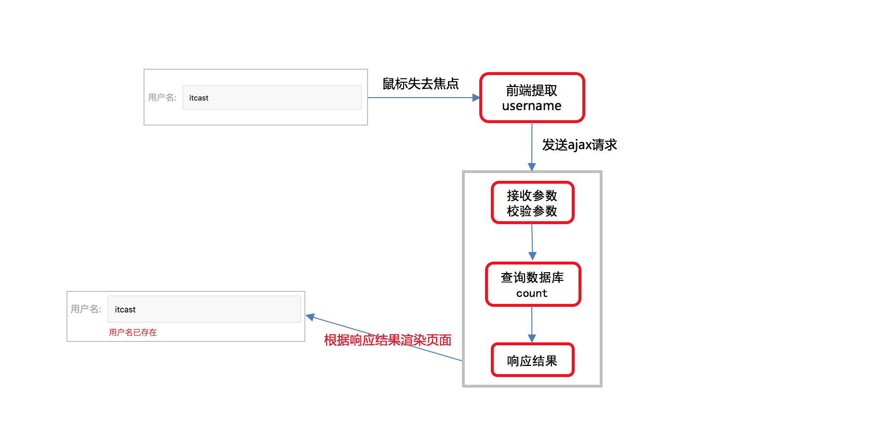
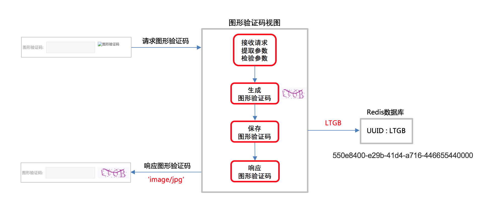
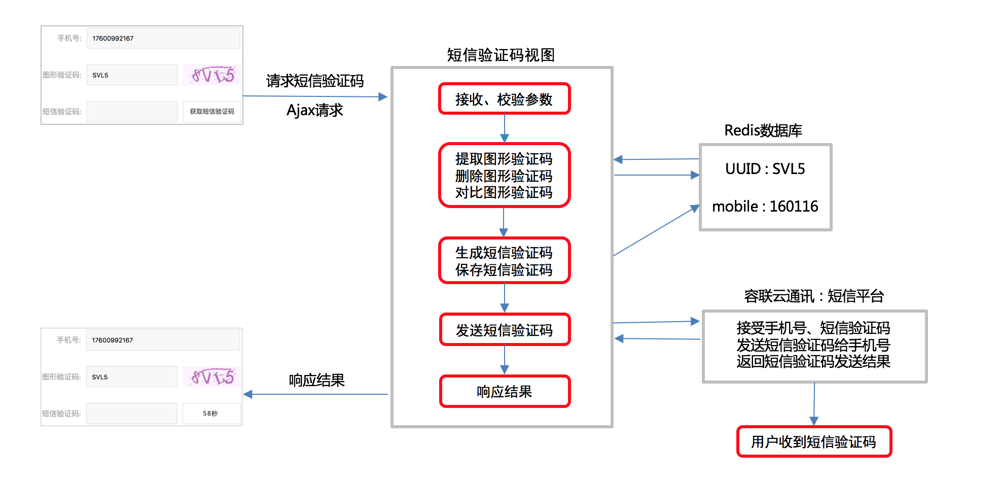

## Django第四天（用户重复注册+图片验证码+容联云）

#### （一）用户名重复注册

- 逻辑分析

  

- 接口设计

  > **请求方式**

  | 选项         | 方案                                                |
  | ------------ | --------------------------------------------------- |
  | **请求方法** | GET                                                 |
  | **请求地址** | /usernames/(?P<username>[a-zA-Z0-9_-]{5,20})/count/ |

  > **2.请求参数：路径参数**

  | 参数名       | 类型   | 是否必传 | 说明   |
  | ------------ | ------ | -------- | ------ |
  | **username** | string | 是       | 用户名 |

  > **3.响应结果：JSON**

  | 响应结果   | 响应内容           |
  | ---------- | ------------------ |
  | **code**   | 状态码             |
  | **errmsg** | 错误信息           |
  | **count**  | 记录该用户名的个数 |

- 后端实现

  ```python
  # 1、往utils文件下添加response_code.py文件
  # 2、url(r'^usernames/(?P<username>[a-zA-Z0-9_-]{5,20})/count/$', views.UsernameExistView.as_view())
  class UsernameExistView(View):
      """
      判断用户名是否已经注册
      """
      def get(self, request, username):
          # 1、接收用户名
          # 2、去数据库查询该用户名是否存在注册数据
          # return HttpResponseForbidden("haha")
          count = User.objects.filter(username=username).count()
          # 3、将查询到的数据返回
          return JsonResponse({"code": RETCODE.OK, 'errmsg': 'OK', 'count': count})
  ```

- 前端实现

  ```python
  let url = "/usernames/"+ this.username + "/count/"
  axios.get(url, {responseType: "json"})
  .then(response=>{
    if (response.data.count == "0"){
      this.error_name = false
    }else{
      this.error_name_message = "用户已经注册"
      this.error_name = true
    }
  }).catch(error=>{
    alert(error)
  })
  ```

#### （二）图片验证码

- 逻辑分析

  

- 接口设计

  > **1.请求方式**

  | 选项         | 方案                           |
  | ------------ | ------------------------------ |
  | **请求方法** | GET                            |
  | **请求地址** | /image_codes/(?P<uuid>[\w-]+)/ |

  > **2.请求参数：路径参数**

  | 参数名   | 类型   | 是否必传 | 说明     |
  | -------- | ------ | -------- | -------- |
  | **uuid** | string | 是       | 唯一编号 |

  > **3.响应结果：image/jpg**

  图片验证码

  - 为什么要单独创建子应用？
  - 什么时候去设置命名空间？
  - uuid代表什么？

- 后端实现

  - 验证码怎么获取？
  - 存储验证码的redis连接怎么得到？

  ```python
  # 1、将课件中的captcha包导入到，verifications下的libs下
  # 2、pip install Pillow
  
  class ImageCodeView(View):
  
      def get(self, request, uuid):
          """
          获取图片验证码
          1、生成文本验证码和图形验证码（调用captcha实现）
          2、将文本验证码保存到redis的2号库（连接redis数据库）
          3、将图片数据返回给用户
          4、当加载页面的时候刷新验证码，当点击验证码的时候刷新验证码。 img标签的特性
          :param request:
          :param image_code_id: uuid唯一标识图形验证码所属与的用户
          :return: image/jpg
          """
          text, image = captcha.generate_captcha()
          redis_conn = get_redis_connection("image_code")
          redis_conn.setex('img_%s' %uuid, 300, text)
         # redis_conn.setex('img_%s' %uuid, constants.IMAGE_CODE_REDIS_EXPIRES, text)
          return HttpResponse(image, content_type='image/jpg')
      
  #HttpResponse(content=响应体,表示返回的内容, content_type=响应体数据类型, status=状态码)**
  content       传递字符串 不要传递 对象,字典等数据
  statue        HTTP status code must be an integer from 100 to 599. 只能使用系统规定的
  content_type  是一个MIME类型，语法形式是: 大类/小类
  text/html   text/css    text/javascript
  application/json 记住
  image/png   image/gif   image/jpg
  ```

- 前端逻辑

  ```js
  generate_image_url() {
    // 一句发请求的代码都没有
    this uuid = generateUUID();
    this.image_url = '/image_codes/' + uuid + '/'
  },
  ```

- 过期时间处理

  - 将过期时间设置为常量 constants.IMAGE_CODE_REDIS_EXPIRES

- 验证码校验和测试

  - 通过vue绑定实现验证码的校验（校验长度是否为4位）

#### （三）云通讯

- 逻辑分析

  

- 第三方容联云介绍

  - 控制台首页
  - 应用管理
  - 测试号码添加
  - https://www.yuntongxun.com/

- 容联云SDK介绍

  - 自己能够通过阅读官方文档集成SDK。并成功发送短信验证码。

- 封装发送短信逻辑（单例模式）（难点，重点）

  ```python
  # 1、单例是什么 : 只初始化一次 单例模式：是一种常用的软件设计模式，该模式的主要目的是确保某一个类只有一个实例存在。当你希望在整个系统中，某个类只能出现一个实例时，就可以使用单例设计模式。
  # 2、单例的实现
  
  def single(cls):
  
      _instance = None
  
      def wrapper(*args, **kwargs):
  
          nonlocal _instance
  
          if not _instance:
  
              _instance = cls(*args, **kwargs)
  
          return _instance
  
      return wrapper
    
    
  @single
  class Person:
      pass
  
  
  a = Person()
  b = Person()
  c = Person()
  
  print(id(a))
  print(id(b))
  print(id(c))
  ```

单例的第二种方法：
```python
class CCP(object):
    def __new__(cls, *args, **kwargs):
        # _instance属性中存储的就是单例，判断是否存在类属性_instance，_instance是类CCP的唯一对象，即单例
        if not hasattr(cls, '_instance'):
            cls._instance = super(CCP, cls).__new__(cls, *args, **kwargs)
            # rest = REST(_serverIP, _serverPort, _softVersion)
            cls._instance.rest = REST(_serverIP, _serverPort, _softVersion)
            cls._instance.rest.setAccount(_accountSid, _accountToken)
            cls._instance.rest.setAppId(_appId)
        return cls._instance
    
    def send_template_sms(self, to, datas, tempId):
        result = self.rest.sendTemplateSMS(to, datas, tempId)
        print(result)
        if result.get('statusCode') == '000000':
            return 0
        else:
            return 1


if __name__ == '__main__':
    # sendTemplateSMS('13236553692', ['888888', 5], 1)
    # # 注意： 测试的短信模板编号为1
    ccp = CCP()
    ccp.send_template_sms('13236553692', ['888888', 5], 1)
```

