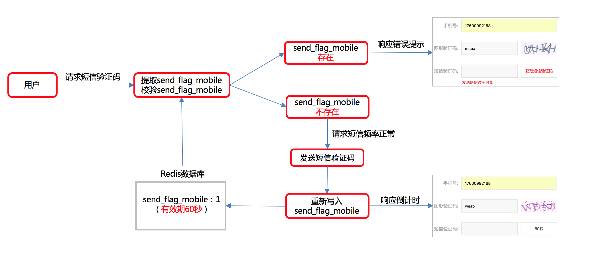

## Django第五天（短信验证码）

#### （一）短信验证码

- 接口定义

  > **请求方式**

  | 选项         | 方案                                |
  | ------------ | ----------------------------------- |
  | **请求方法** | GET                                 |
  | **请求地址** | /sms_codes/(?P<mobile>1[3-9]\d{9})/ |

  > **2.请求参数：路径参数和查询字符串**

  | 参数名         | 类型   | 是否必传 | 说明       |
  | -------------- | ------ | -------- | ---------- |
  | **mobile**     | string | 是       | 手机号     |
  | **image_code** | string | 是       | 图形验证码 |
  | **uuid**       | string | 是       | 唯一编号   |

  > **3.响应结果：JSON**

  | 字段       | 说明     |
  | ---------- | -------- |
  | **code**   | 状态码   |
  | **errmsg** | 错误信息 |

- 后端逻辑（未完善）

  - 后端逻辑——接收和校验参数
  - 后端逻辑——对比图片验证码
  - 后端逻辑——发送短信验证码

  ```python
  class SendSMSCodeView(View):
  
      def get(self, request, mobile):
  
          image_code_client = request.GET.get("image_code")
          uuid = request.GET.get("uuid")
  
          if not all([image_code_client, uuid]):
              return JsonResponse({'code': RETCODE.NECESSARYPARAMERR, 'errmsg': '缺少必传参数'})
          # 创建连接到redis的对象
          redis_conn = get_redis_connection('image_code')
          # 提取图形验证码
          image_code_server = redis_conn.get('img_{} %s' %uuid）
          if image_code_server is None:
              # 图形验证码过期或者不存在
              return JsonResponse({'code': RETCODE.IMAGECODEERR, 'errmsg': '图形验证码失效'})
          # 删除图形验证码，避免恶意测试图形验证码
          redis_conn.delete('img_%s' % uuid)
  
          # 对比图形验证码
          image_code_server = image_code_server.decode()  # bytes转字符串
          if image_code_client.lower() != image_code_server.lower():  # 转小写后比较
              return JsonResponse({'code': RETCODE.IMAGECODEERR, 'errmsg': '输入图形验证码有误'})
  
          # 生成短信验证码：生成6位数验证码
          sms_code = '%06d' % random.randint(0, 999999)
          # 保存短信验证码
          redis_conn.setex('sms_%s' % mobile, constants.SMS_CODE_REDIS_EXPIRES, sms_code)
          # 发送短信验证码
          result = CCP().send_sms_code(mobile, [sms_code, constants.SMS_CODE_REDIS_EXPIRES // 60],
                                  constants.SEND_SMS_TEMPLATE_ID)
  
          if result != 0:
              return JsonResponse({'code': RETCODE.SMSSENDERROR, 'errmsg': '验证码发送失败'})
  
          # 响应结果
          return JsonResponse({'code': RETCODE.OK, 'errmsg': '发送短信成功'})
  ```

- 前端逻辑

  - 前端逻辑——ajax获取前端验证码
  - 前端逻辑——60秒倒计时功能（非重点）
  - 前端逻辑——防止页面点击频繁发送（难点，非重点）

  ```python
  send_sms_code(){
    if (this.send_flag == true){
      return;
    }
    this.send_flag = true;
  
    this.check_mobile();
    this.check_image_code();
  
    if (this.error_mobile == true || this.error_image_code == true) {
      this.send_flag = false;
      return;
    }
    var url = "/sms_codes/"+ this.mobile +"/";
    axios.get(url, {
      params:{
        "image_code": this.image_code,
        "uuid": this.uuid
      },
      responseType: "json"
    }).then(response=>{
      if (response.data.code == "0"){
        this.error_sms_code = false
        // 短信发送成功，进入倒计时
        var num = 60;
        t = setInterval(() => {
          if (num != "1"){
            // 进入倒计时
            // 1、num递减
            num -= 1;
            // 2、修改sms_code_tip
            this.sms_code_tip = num + "秒"
          }else{
            // 倒计时结束
            // 1、修改sms_code_tip
            this.sms_code_tip = "点击发送验证码";
            // 2、刷新短信验证码
            this.generate_image_url();
            // 3、删除计时器
            clearInterval(t);
            this.send_flag = false;
          }
        }, 1000)
      }else if (response.data.code == "4001"){
        this.error_sms_code_message = response.data.errmsg;
        this.error_sms_code = true
        this.send_flag = false;
      }
  
    }).catch(error=>{
      console.log(error);
      this.send_flag = false;
    })
  },
  ```

- 短信验证码——日志输出

  ```python
  import logging
  logger = logging.getLogger("django")
  logger.info("短信验证码是：%s" % sms_code)
  ```

- 补充注册逻辑

  ```python
  redis_conn = get_redis_connection("verify_code")
  real_sms_code = redis_conn.get('sms_%s' % mobile)
  if not real_sms_code:
    return render(request, "register.html", {"sms_code_error": "短信验证码已过期"})
  
  if real_sms_code.decode() != sms_code_client:
    return render(request, "register.html", {"sms_code_error": "短信验证码输入有误"})
  ```

- 后端逻辑——防止频发发送验证码分析

  

- 后端逻辑——防止频发发送验证码实现

  ```python
  # 先判断是否已存在标记
  sms_code_flag = redis_conn.get("sms_code_flag_%s" % mobile)
  if sms_code_flag:
    return JsonResponse({'code': RETCODE.THROTTLINGERR, 'errmsg': '验证码获取频繁'})
      
  # 在保存的时候，要设计标记
  redis_conn.setex('sms_%s' % mobile, constants.SMS_CODE_REDIS_EXPIRES, sms_code)
  redis_conn.setex("sms_code_flag_%s" % mobile, constants.SMS_CODE_REDIS_EXPIRES, 1)
  ```

- pipeline的使用

  ```python
  redis_conn = get_redis_connection('verify_code')
  pl = redis_conn.pipeline()
  pl.setex('sms_%s' % mobile, constants.SMS_CODE_REDIS_EXPIRES, sms_code)
  pl.setex("sms_code_flag_%s" % mobile, constants.SMS_CODE_REDIS_EXPIRES, 1)
  pl.execute()
  ```
