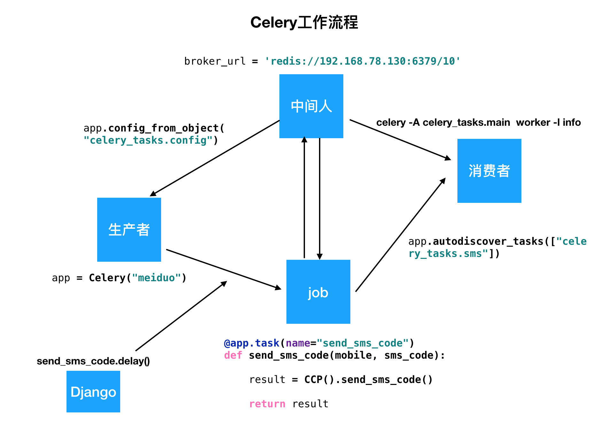

## Django第六天（celery+用户登录方式一）

#### （一）异步Celery

- 生产者和消费者模式

  ```python
  from threading import Thread
  import queue
  import time
  
  # 生产者：Producer
  # 消费者：Customer
  # 中间人：Queue()
  # 任务： msg = "产品 %d" % count
  
  # 创建一个队列，保存生产数据
  q = queue.Queue()
  
  class Producer(Thread):
      """用类实现生产者多线程的写法"""
      def run(self):
          count = 0
          while True:
              if q.qsize() < 2:  # 判断队列中的任务个数是否小于50
                  for i in range(3):  # 如果小于50件，每次生产三件
                      count += 1
                      msg = "产品 %d" % count
                      q.put(msg)
                      print('生产了%s' % msg)
              time.sleep(1)
  
  
  class Customer(Thread):
      """用类实现消费者多线程的写法"""
  
      def run(self):
          while True:
              if q.qsize() > 1:  # 如果队列中的任务个数大于20个。每次消费2个
                  for i in range(2):
                      msg = q.get()
                      print("消费了%s" % msg)
              time.sleep(1)
  
  
  # 每秒生产3条数据，生产了51条数据阻塞
  p = Producer()
  p.start()
  
  c = Customer()
  c.start()
  ```

- celery介绍

  - 一个简单、灵活且可靠、处理大量消息的分布式系统，可以在一台或者多台机器上运行。
  - 单个 Celery 进程每分钟可处理数以百万计的任务。
  - 通过消息进行通信，使用`消息队列（broker）`在`客户端`和`消费者`之间进行协调。

- 创建celery实例并加载配置（生产者和中间人）

  - 在第一个meiduo_mall下创建celery_tasks包

  - 新建一个main文件，创建生产者。

  - 新建一个config文件，创建中间人redis。

  - 在main中告知生产者，中间人是谁。

    ```python
    from celery import Celery
    app = Celery("meiduo")
    app.config_from_object("celery_tasks.config")
    ```

- 自定发送验证码任务（任务）

  ```python
  from . import constants
  from celery_tasks.sms.yuntongxun.ccp_sms import CCP
  from celery_tasks.main import celery_app
  
  @celery_app.task(name="ccp_send_sms_code")
  def ccp_send_sms_code(mobile, sms_code):
      result = CCP().send_sms_code(mobile, [sms_code, constants.SMS_CODE_REDIS_EXPIRES // 60], constants.SEND_SMS_TEMPLATE_ID)
  
      return result
  ```

- 启动celery（启动消费者）

  ```python
  celery -A celery_tasks.main worker -l info
  ```

- 调用发送验证码任务

  ```python
  ccp_send_sms_code.delay(mobile, sms_code)
  ```

- celery小结

  

#### （二）用户登录

- 业务逻辑分析

  

- 接口设计和定义

  > **1.请求方式**

  | 选项         | 方案    |
  | ------------ | ------- |
  | **请求方法** | POST    |
  | **请求地址** | /login/ |

  > **2.请求参数：表单**

  | 参数名         | 类型   | 是否必传 | 说明         |
  | -------------- | ------ | -------- | ------------ |
  | **username**   | string | 是       | 用户名       |
  | **password**   | string | 是       | 密码         |
  | **remembered** | string | 是       | 是否记住用户 |

  > **3.响应结果：HTML**

  | 字段         | 说明         |
  | ------------ | ------------ |
  | **登录失败** | 响应错误提示 |
  | **登录成功** | 重定向到首页 |

- 后端逻辑  

- 处理密码的方法

  - 设置密码：`set_password(raw_password)`
  - 校验密码：`check_password(raw_password)`

- 用户认证(用户登录)的方法 位置：django.contrib.auth.backends.ModelBackend。

  ```python
  from django.contrib.auth import authenticate
  user = authenticate(username=username, password=password, **kwargs)
  ```

  ```python
  class LoginView(View):
  
      def get(self, request):
  
          return render(request, 'login.html')
  
      def post(self, request):
  
          username = request.POST.get('username')
          password = request.POST.get('password')
          remembered = request.POST.get('remembered')
  
          # 校验参数
          # 判断参数是否齐全
          if not all([username, password]):
              return HttpResponseForbidden('缺少必传参数')
  
          # 判断用户名是否是5-20个字符
          if not re.match(r'^[a-zA-Z0-9_-]{5,20}$', username):
              return HttpResponseForbidden('请输入正确的用户名或手机号')
  
          # 判断密码是否是8-20个数字
          if not re.match(r'^[0-9A-Za-z]{8,20}$', password):
              return HttpResponseForbidden('密码最少8位，最长20位')
  
          # 认证登录用户
          user = authenticate(username=username, password=password)
          if user is None:
              return render(request, 'login.html', {'account_errmsg': '用户名或密码错误'})
  
          # 实现状态保持
          login(request, user)
          # 设置状态保持的周期
          if remembered != 'on':
              # 没有记住用户：浏览器会话结束就过期
              request.session.set_expiry(0)
          else:
              # 记住用户：None表示两周后过期
              request.session.set_expiry(None)
  
          # 响应注册结果
          response = redirect(reverse('contents:index'))
  
          # 注册时用户名写入到cookie，有效期15天
          response.set_cookie('username', user.username, max_age=3600 * 24 * 15)
  
          return response
  ```

- 用户认证原理分析和实现

  ```python
  from django.contrib.auth.backends import ModelBackend
  from .models import User
  
  
  def get_user_by_account(account):
      """
      根据account查询用户
      :param account: 用户名或者手机号
      :return: user
      """
      #try:
      #   user = User.objects.get(username=account)
      #except User.DoesNotExist:
      #    try:
      #        user = User.objects.get(mobile=account)
      #    except User.DoesNotExist:
      #        return None
      #return user
  	try:
          user = User.objects.get(Q(username=account)|Q(mobile=account))
      except User.DoesNotExist:
          return None
      return user
  
  
  class UsernameMobileAuthBackend(ModelBackend):
      """自定义用户认证后端"""
  
      def authenticate(self, request, username=None, password=None, **kwargs):
  
          # 根据传入的username获取user对象。username可以是手机号也可以是账号
          user = get_user_by_account(username)
          # 校验user是否存在并校验密码是否正确
          if user and user.check_password(password):
              return user
            
  # 在配置文件中添加
  AUTHENTICATION_BACKENDS = ['users.utils.UsernameMobileAuthBackend']
  ```

- 用户登录之首页用户名展示-方案介绍

  - 模板中 **request** 变量直接渲染用户名

    ```python
    
        <div class="login_btn fl">
            欢迎您：<em>{{ user.username }}</em>
            <span>|</span>
            <a href="#">退出</a>
        </div>
        
        <div class="login_btn fl">
            <a href="login.html">登录</a>
            <span>|</span>
            <a href="register.html">注册</a>
        </div>
    
    ```

  - 写入到cookie

- 写入到cookie方案实现

  ```python
  # 后端在注册逻辑和登录逻辑
  response = redirect(reverse('contents:index'))
  
  # 注册时用户名写入到cookie，有效期15天
  response.set_cookie('username', user.username, max_age=3600 * 24 * 15)
  
  return response
  
  # 前端
  <div v-if="username" class="login_btn fl">
      欢迎您：<em>[[ username ]]</em>
      <span>|</span>
      <a href="#">退出</a>
  </div>
  <div v-else class="login_btn fl">
      <a href="login.html">登录</a>
      <span>|</span>
      <a href="register.html">注册</a>
  </div>
  ```

- 用户登录之退出登录

  ```python
  class LogoutView(View):
      """退出登录"""
  
      def get(self, request):
          """实现退出登录逻辑"""
          # 清理session
          logout(request)
          # 退出登录，重定向到登录页
          response = redirect(reverse('contents:index'))
          # 退出登录时清除cookie中的username
          response.delete_cookie('username')
  
          return response
  ```


###  login 方法：

1. 用户登入本质：

   - **状态保持**
   - 将通过认证的用户的唯一标识信息（比如：用户ID）写入到当前浏览器的 cookie 和服务端的 session 中。

2. login()方法：

   - Django用户认证系统提供了`login()`方法。
   - 封装了写入session的操作，帮助我们快速登入一个用户，并实现状态保持。

3. login()位置：

   - `django.contrib.auth.__init__.py`文件中。

     ```python
     login(request, user, backend=None)
     ```


### logout 方法

1. 退出登录：
   - 回顾登录：将通过认证的用户的唯一标识信息，写入到当前session会话中
   - 退出登录：正好和登录相反（清理session会话信息）
2. logout()方法：
   - Django用户认证系统提供了`logout()`方法
   - 封装了清理session的操作，帮助我们快速实现登出一个用户
3. logout()位置：
   - `django.contrib.auth.__init__.py`文件中

```python
logout(request)
```


真正意义的实现用户登录状态保持是设置了session信息，如果仅仅有cookies信息，没有session信息，只是一个伪登录的状态，所以为了让首页显示不出错误的话，必须删除用户登录的时候设置的cookies信息

1. 由于首页中用户名是从cookie中读取的。所以退出登录时，需要将cookie中用户名清除。
2. 退出登录的核心思想就是清理登录时缓存的状态保持信息。
3. Django自带的用户认证系统只会使用用户名去认证一个用户。
   - 所以我们为了实现多账号登录，就可以自定义认证后端，采用其他的唯一信息去认证一个用户。