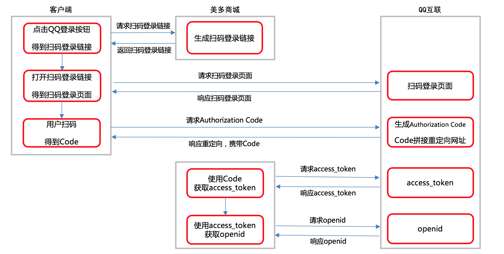

## Django第七天（用户中心页+QQ登录）

#### （一）用户中心页（只渲染）

- 渲染中心页面

  - 装饰器方法一

    ```python
    # 给指定的方法加装饰器
    @method_decorator(login_required)
    ```

  - 装饰器方法二

    ```python
    # 视图中所有的方法加装饰器
    @method_decorator(login_required)
        def dispatch(self, request, *args, **kwargs):
            return super(UserInfoView, self).dispatch(request, *args, **kwargs)
    ```

- LoginRequiredMixin（判断用户是否登录）
  - 为什么要使用LoginRequiredMixin

    - 帮我们封装了用户登录认证的代码。并且能够记录重定向的地址。

    - ```
      class UserInfoView(LoginRequiredMixin,View):
      	login_url = '/login/' # 判断用户是否登录，用户未登录的重定向的地址
          redirect_field_name = 'redirect_to' # 重定向的地址的名字
      ```

    - 

  - 怎么使用LoginRequiredMxin？

    - 先继承LoginRequiredMixin，后继承View。

  - LoginRequiredMixin的原理是什么？？

    

- LoginRequiredMixin-next参数的使用

  ```python
  next_url = request.GET.get("next")
  if next_url:
    response = redirect(next_url)
  
    # 响应注册结果
    else:
      response = redirect(reverse('contents:index'))
  ```

### (二）QQ登录

- 内容介绍与演示
  
  - 点击QQ，通过扫描二维码登录到美多商城。
  
- 获取OpenID流程分析
  - 开发文档-获取Authorization Code
  
    > **请求方式**
  
    | 选项         | 方案                                    |
    | ------------ | --------------------------------------- |
    | **请求方法** | GET                                     |
    | **请求地址** | https://graph.qq.com/oauth2.0/authorize |
  
    > **2.请求参数：查询字符串**
  
    | 参数名            | 类型   | 是否必传 | 说明                                       |
    | ----------------- | ------ | -------- | ------------------------------------------ |
    | **response_type** | string | 是       | 授权类型，此值固定为“code”                 |
    | **client_id**     | string | 是       | 101518219                                  |
    | **redirect_uri**  | string | 是       | http://www.meiduo.site:8000/oauth_callback |
    | **state**         | string | 是       | /info/                          |
  
    > **3.响应结果：**
    >
    > - 二维码，当用户扫描二维码后，http://www.meiduo.site:8000/oauth_callback?code="xxxxxxxx"
  
  - 开发文档-获取Token
  
    > **请求方式**
  
    | 选项         | 方案                                |
    | ------------ | ----------------------------------- |
    | **请求方法** | GET                                 |
    | **请求地址** | https://graph.qq.com/oauth2.0/token |
  
    > **2.请求参数：查询字符串**
  
    | 参数名            | 类型   | 是否必传 | 说明                                       |
    | ----------------- | ------ | -------- | ------------------------------------------ |
    | **grant_type**    | string | 是       | authorization_code                         |
    | **client_id**     | string | 是       | 101518219                                  |
    | **redirect_uri**  | string | 是       | http://www.meiduo.site:8000/oauth_callback |
    | **client_secret** | string | 是       | 418d84ebdc7241efb79536886ae95224           |
    | **code**          | string | 是       | Authorization Code                         |
  
    > **3.响应结果：**
    >
  
    | **参数说明**  |                           **描述**                           |
    | :-----------: | :----------------------------------------------------------: |
    | access_token  |                   授权令牌，Access_Token。                   |
    |  expires_in   |              该access token的有效期，单位为秒。              |
    | refresh_token | 在授权自动续期步骤中，获取新的Access_Token时需要提供的参数。注：refresh_token仅一次有效 |
  
  - 开发文档-获取OpenID
  
      > 请求方式**

      | 选项         | 方案                             |
      | ------------ | -------------------------------- |
      | **请求方法** | GET                              |
      | **请求地址** | https://graph.qq.com/oauth2.0/me |

        > **2.请求参数：查询字符串**

      | 参数         | 是否必须 | 含义                            |
      | ------------ | -------- | ------------------------------- |
      | access_token | 必须     | 在Step1中获取到的access token。 |
  
  - QQ互联整体流程

    

- 获取OpenId代码编写
  - 定义QQ模型类

    ```python
    from django.db import models
    from oauth.utils import BaseModel
    
    class OAuthQQUser(BaseModel):
        """QQ登录用户数据"""
        user = models.ForeignKey('users.User', on_delete=models.CASCADE, verbose_name='用户')
        openid = models.CharField(max_length=64, verbose_name='openid', db_index=True)
    
        class Meta:
            db_table = 'tb_oauth_qq'
            verbose_name = 'QQ登录用户数据'
            verbose_name_plural = verbose_name
    ```

  - QQLoginTool的使用

    ```bash
    pip install QQLoginTool
    ```

  - QQ登录扫码页面

    > **请求方式**

    | 选项         | 方案       |
    | ------------ | ---------- |
    | **请求方法** | GET        |
    | **请求地址** | /qq/login/ |

    > **2.请求参数：查询参数**

    | 参数名   | 类型   | 是否必传 | 说明                           |
    | -------- | ------ | -------- | ------------------------------ |
    | **next** | string | 否       | 用于记录QQ登录成功后进入的网址 |

    > **3.响应结果：JSON**

    | 字段          | 说明               |
    | ------------- | ------------------ |
    | **code**      | 状态码             |
    | **errmsg**    | 错误信息           |
    | **login_url** | QQ登录扫码页面链接 |

    ```python
    class QQAuthURLView(View):
        """提供QQ登录页面网址
        https://graph.qq.com/oauth2.0/authorize?response_type=code&client_id=xxx&redirect_uri=xxx&state=xxx
        """
        def get(self, request):
            # next表示从哪个页面进入到的登录页面，将来登录成功后，就自动回到那个页面
            next = request.GET.get('next')
    
            # 获取QQ登录页面网址
            oauth = OAuthQQ(client_id=settings.QQ_CLIENT_ID,
                            client_secret=settings.QQ_CLIENT_SECRET,
                            redirect_uri=settings.QQ_REDIRECT_URI,
                            state=next)
    
            login_url = oauth.get_qq_url()
    
            return JsonResponse({'code': RETCODE.OK, 'errmsg': 'OK', 'login_url':login_url})
    ```

  - 配置域名

    ```python
    # vim /etc/hosts
    127.0.0.1 :  www.meiduo.site
    # ALLOWED_HOSTS = ['www.meiduo.site']
    ALLOWED_HOSTS = ['*']
    ```

  - 获取Authorization Code

    ```python
    class QQAuthUserView(View):
        """用户扫码登录的回调处理"""
    
        def get(self, request):
            """Oauth2.0认证"""
            # 提取code请求参数
            code = request.GET.get('code')
            if not code:
                return HttpResponseForbidden('缺少code')
    
            # 创建工具对象
            oauth = OAuthQQ(client_id=settings.QQ_CLIENT_ID, client_secret=settings.QQ_CLIENT_SECRET, redirect_uri=settings.QQ_REDIRECT_URI)
    
            try:
                # 使用code向QQ服务器请求access_token
                access_token = oauth.get_access_token(code)
    
                # 使用access_token向QQ服务器请求openid
                openid = oauth.get_open_id(access_token)
            except Exception as e:
                logger.error(e)
                return HttpResponseServerError('OAuth2.0认证失败')
            pass
            # TODO: 判断openid是否和用户绑定
    ```

  - 获取Token和OpenId

    


