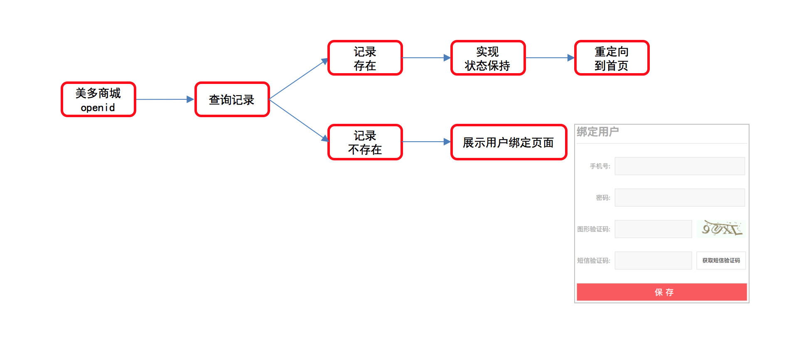
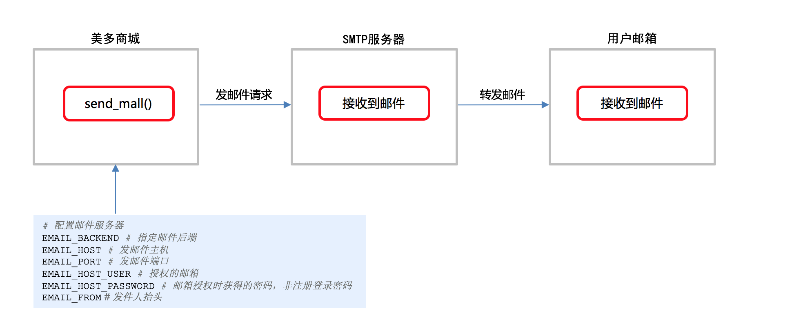

## Django第八天（QQ登录+用户中心）

#### （一）QQ登录

- openid绑定用户流程分析

  - openid已经绑定 —— 直接跳转到首页或者info
  - openid没有绑定 —— 跳转到新的类似于注册页面
    - 如果手机号已经存在— 直接拿openid和用户绑定
    - 如果手机号不存在 — 新建用户与openid绑定

  

- 判断openid是否绑定过用户 

  ```python
  try:
      oauth_user = OAuthQQUser.objects.get(openid=openid)
  except OAuthQQUser.DoesNotExist:
      # 如果openid没绑定美多商城用户
      pass
  else:
      # 如果openid已绑定美多商城用户
      pass
  ```

  

- openid已绑定用户的处理-直接登入美多商城 

  ```python
  try:
      oauth_user = OAuthQQUser.objects.get(openid=openid)
  except OAuthQQUser.DoesNotExist:
      # 如果openid没绑定美多商城用户
      pass
  else:
      # 如果openid已绑定美多商城用户
      # 实现状态保持
      qq_user = oauth_user.user
      login(request, qq_user)
      # 响应结果
      next = request.GET.get('state')
      response = redirect(next)
      # 登录时用户名写入到cookie，有效期15天
      response.set_cookie('username', qq_user.username, max_age=3600 * 24 * 15)
      return response
  ```

- 把openid渲染到页面（标识用户）

  ```python
  try:
      oauth_user = OAuthQQUser.objects.get(openid=openid)
  except OAuthQQUser.DoesNotExist:
      # 如果openid没绑定美多商城用户
      context = {'openid': openid}
      return render(request, 'oauth_callback.html', context)
  else:
     	pass
  ```

- openid序列化 

  ```python
  def generate_eccess_token(openid):
      """
      签名openid
      :param openid: 用户的openid
      :return: access_token
      """
      serializer = Serializer(settings.SECRET_KEY, 	
      												expires_in=constants.ACCESS_TOKEN_EXPIRES)
      data = {'openid': openid}
      token = serializer.dumps(data)
      return token.decode()
  ```

- 判断openid是否有效（过期）

  ```python
  def check_access_token(token):
    """
    验签名
    """
    serializer = Serializer(settings.SECRET_KEY, 	
      												expires_in=constants.ACCESS_TOKEN_EXPIRES)
    try:
       data = serializer.loads(token)
    except:
       return None
    else:
       return data
  ```

  

- openid绑定美多商城用户

  ```python
  class QQAuthUserView(View):
      """用户扫码登录的回调处理"""
  
      def get(self, request):
          """Oauth2.0认证"""
          ...
  
      def post(self, request):
          """美多商城用户绑定到openid"""
          # 接收参数
          ...
          # 校验参数
          # 判断参数是否齐全
          # 判断手机号是否合法
          # 判断密码是否合格
          # 判断短信验证码是否一致
      		...
          # 判断openid是否有效：错误提示放在sms_code_errmsg位置
          openid = check_access_token(access_token)
          if not openid:
              return render(request, 'oauth_callback.html', {'openid_errmsg': '无效的openid'})
  
          # 保存注册数据
          try:
              user = User.objects.get(mobile=mobile)
          except User.DoesNotExist:
              # 用户不存在,新建用户
              user = User.objects.create_user(username=mobile, password=pwd, mobile=mobile)
          else:
              # 如果用户存在，检查用户密码
              if not user.check_password(pwd):
                  return render(request, 'oauth_callback.html', {'account_errmsg': '用户名或密码错误'})
  
          # 将用户绑定openid
          try:
              OAuthQQUser.objects.create(openid=openid, user=user)
          except DatabaseError:
              return render(request, 'oauth_callback.html', {'qq_login_errmsg': 'QQ登录失败'})
  
          # 实现状态保持
          # 响应绑定结果
          # 登录时用户名写入到cookie，有效期15天
  				...
          return response
  ```

  

####（二）用户中心

- 用户中心之内容介绍 

- 用户基本信息

  - 逻辑分析 

    1. 用户模型补充`email_active`字段
    2. 查询并渲染用户基本信息
    3. 添加邮箱
    4. 发送邮箱验证邮件
    5. 验证邮箱

  - 补充email_active字段 

    ```python
    class User(AbstractUser):
        """自定义用户模型类"""
        mobile = models.CharField(max_length=11, unique=True, verbose_name='手机号')
        email_active = models.BooleanField(default=False, verbose_name='邮箱验证状态')
    ```

  - 查询并渲染用户基本信息  （24分37秒）

    - request.user的使用

    ```python
    class UserInfoView(LoginRequiredMixin, View):
        """用户中心"""
    
        def get(self, request):
            """提供个人信息界面"""
            context = {
                'username': request.user.username,
                'mobile': request.user.mobile,
                'email': request.user.email,
                'email_active': request.user.email_active
            }
            return render(request, 'user_center_info.html', context=context)
    ```

    - 模板变量被vue使用。

    ```html
    <script type="text/javascript">
            let username = "{{ username }}";
            let mobile = "{{ mobile }}";
            let email = "{{ email }}";
            let email_active = "{{ email_active }}";
        </script>
        <script type="text/javascript" src="{{ static('js/common.js') }}"></script>
        <script type="text/javascript" src="{{ static('js/user_center_info.js') }}"></script>
    ```

- 邮箱设置

  - 添加邮箱接口定义

    > **请求方式**

    | 选项         | 方案     |
    | ------------ | -------- |
    | **请求方法** | PUT      |
    | **请求地址** | /emails/ |

    > **2.请求参数**

    | 参数名    | 类型   | 是否必传 | 说明 |
    | --------- | ------ | -------- | ---- |
    | **email** | string | 是       | 邮箱 |

    > **3.响应结果：JSON**

    | 字段       | 说明     |
    | ---------- | -------- |
    | **code**   | 状态码   |
    | **errmsg** | 错误信息 |

  - 添加邮箱（未用户认证）

    ```python
    class EmailView(View):
        """添加邮箱"""
        def put(self, request):
            """实现添加邮箱逻辑"""
            # 接收参数
            json_dict = json.loads(request.body.decode())
            email = json_dict.get('email')
            # 校验参数
            if not email:
                return http.HttpResponseForbidden('缺少email参数')
            if not re.match(r'^[a-z0-9][\w\.\-]*@[a-z0-9\-]+(\.[a-z]{2,5}){1,2}$', email):
                return http.HttpResponseForbidden('参数email有误')
            # 赋值email字段
            try:
                request.user.email = email
                request.user.save()
            except Exception as e:
                logger.error(e)
                return http.JsonResponse({'code': RETCODE.DBERR, 'errmsg': '添加邮箱失败'})
    
            # 响应添加邮箱结果
            return http.JsonResponse({'code': RETCODE.OK, 'errmsg': '添加邮箱成功'})
    ```

  - 添加邮箱后端逻辑（自定义）

    ```python
    from django.contrib.auth.mixins import LoginRequiredMixin
    from django.http import JsonResponse
    
    from utils.response_code import RETCODE
    
    
    class LoginRequiredJSONMixin(LoginRequiredMixin):
        """Verify that the current user is authenticated."""
    
        def handle_no_permission(self):
            return JsonResponse({'code': RETCODE.SESSIONERR, 'errmsg': '用户未登录'})
    ```

    

- 邮件发送
  - django发送邮件流程分析 
  
    
  
  - 准备发邮件服务器  
  
    ```python
    EMAIL_BACKEND = 'django.core.mail.backends.smtp.EmailBackend' # 指定邮件后端
    EMAIL_HOST = 'smtp.163.com' # 发邮件主机
    EMAIL_PORT = 25 # 发邮件端口
    EMAIL_HOST_USER = '' # 授权的邮箱
    EMAIL_HOST_PASSWORD = '' # 邮箱授权时获得的密码，非注册登录密码
    EMAIL_FROM = '美多商城<hmmeiduo@163.com>' # 发件人抬头
    ```
  
  - 调用发送邮件方法
  
    ```python
    from django.core.mail import send_mail
    
    send_mail(subject, message, from_email, recipient_list, html_message=None)
    	
    # subject 邮件标题
    # message 普通邮件正文，普通字符串
    # from_email 发件人
    # recipient_list 收件人列表
    # html_message 多媒体邮件正文，可以是html字符串
    
    ```
  
    