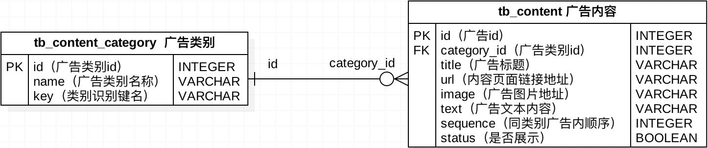

## Django第十一天（商品）

#### （一）数据表分析

- SPU和SKU

  - **SPU = Standard Product Unit （标准产品单位）**
  - **SKU = Stock Keeping Unit （库存量单位）**

- 首页广告类别表分析

  

- 首页广告数据表迁移

  ```python
  class ContentCategory(BaseModel):
      """广告内容类别"""
      name = models.CharField(max_length=50, verbose_name='名称')
      key = models.CharField(max_length=50, verbose_name='类别键名')
  
      class Meta:
          db_table = 'tb_content_category'
          verbose_name = '广告内容类别'
          verbose_name_plural = verbose_name
  
      def __str__(self):
          return self.name
  
  
  class Content(BaseModel):
      """广告内容"""
      category = models.ForeignKey(ContentCategory, on_delete=models.PROTECT, verbose_name='类别')
      title = models.CharField(max_length=100, verbose_name='标题')
      url = models.CharField(max_length=300, verbose_name='内容链接')
      image = models.ImageField(null=True, blank=True, verbose_name='图片')
      text = models.TextField(null=True, blank=True, verbose_name='内容')
      sequence = models.IntegerField(verbose_name='排序')
      status = models.BooleanField(default=True, verbose_name='是否展示')
  
      class Meta:
          db_table = 'tb_content'
          verbose_name = '广告内容'
          verbose_name_plural = verbose_name
  
      def __str__(self):
          return self.category.name + ': ' + self.title
        
  # 1、python manage.py makemigrations
  # 2、python manage.py migrate
  ```

- 数据库表分析

  - 商品分类表分析
  - 商品品牌-SPU-SKU表分析
  - 商品SKU-SKU图片表分析
  - 商品规格表分析

  

- 商品数据库表迁移

  ```python
  # 0、参考课件复制模型类
  # 1、python manage.py makemigrations
  # 2、python manage.py migrate
  ```

#### （二）FastDFS（工作原理）

- 商品图片存储方案说明

  - 人工去重（维护繁琐）
  - 占用项目内存资源和硬件资源（降低性能）

- FastDFS架构和工作机制介绍

  

  - 用`c语言`编写的一款开源的轻量级分布式文件系统。

  ```python
  # 1、高可用
  # 2、高吞吐
  # 3、可伸缩性
  ```

- FastDFS索引介绍

  

  - **组名**：文件上传后所在的 Storage 组名称。
  - **虚拟磁盘路径**：Storage 配置的虚拟路径，与磁盘选项`store_path*`对应。如果配置了`store_path0`则是`M00`，如果配置了`store_path1`则是`M01`，以此类推。
  - **数据两级目录**：Storage 服务器在每个虚拟磁盘路径下创建的两级目录，用于存储数据文件。
  - **文件名**：由存储服务器根据特定信息生成，文件名包含:源存储服务器IP地址、文件创建时间戳、文件大小、随机数和文件拓展名等信息。

#### （三）docker

- docker介绍

  - Docker 是一个开源的软件部署解决方案。
  - Docker 也是轻量级的应用容器框架。
  - Docker 可以打包、发布、运行任何的应用。
  - Docker 就像一个盒子，里面可以装很多物件，如果需要某些物件，可以直接将该盒子拿走，而不需要从该盒子中一件一件的取。
  - 镜像，容器，仓库

- Docker安装

  - 源码安装

    ```shell
    $ cd docker源码目录
    $ sudo apt-key add gpg
    $ sudo dpkg -i docker-ce_17.03.2~ce-0~ubuntu-xenial_amd64.deb
    ```

  - 安装检查

    ```shell
    $ sudo docker run hello-world
    ```

  - docker的启动和停止

    ```shell
    # 启动docker
    $ sudo service docker start
    # 重启docker
    $ sudo service docker restart
    # 停止docker
    $ sudo service docker stop
    ```

- Docker镜像操作

  - 查看镜像

    ```shell
    $ sudo docker image ls
    
    * REPOSITORY：镜像所在的仓库名称 
    * TAG：镜像标签 
    * IMAGEID：镜像ID 
    * CREATED：镜像的创建日期(不是获取该镜像的日期) 
    * SIZE：镜像大小
    ```

  - 拉取镜像

    ```shell
    # 官方镜像
    $ sudo docker image pull 镜像名称 或者 sudo docker image pull library/镜像名称
    $ sudo docker image pull ubuntu 或者 sudo docker image pull library/ubuntu
    $ sudo docker image pull ubuntu:16.04 或者 sudo docker image pull library/ubuntu:16.04
    
    # 个人镜像
    $ sudo docker image pull 仓库名称/镜像名称
    $ sudo docker image pull itcast/fastdfs
    ```

  - 删除镜像

    ```shell
    # 如果需要删除的镜像处于打开状态，需要先停止和删除容器，然后删除镜像
    # 注意：镜像的id和容器的id不一样
    $ sudo docker image rm 镜像名或镜像ID
    $ sudo docker image rm hello-world
    $ sudo docker image rm fce289e99eb9
    ```

- Docker容器操作

  - 查看容器

    ```shell
    # 查看正在运行的容器
    $ sudo docker container ls
    # 查看所有的容器
    $ sudo docker container ls --all
    ```

  - 创建容器

    ```shell
    $ sudo docker run [option] 镜像名 [向启动容器中传入的命令]
    
    常用可选参数说明：
    * -i 表示以《交互模式》运行容器。
    * -t 表示容器启动后会进入其命令行。加入这两个参数后，容器创建就能登录进去。即分配一个伪终端。
    * --name 为创建的容器命名。
    * -v 表示目录映射关系，即宿主机目录:容器中目录。最好做目录映射，在宿主机上做修改，然后共享到容器上。 
    * -d 会创建一个守护式容器在后台运行(这样创建容器后不会自动登录容器)。 
    * -p 表示端口映射，即宿主机端口:容器中端口。
    * --network=host 表示将主机的网络环境映射到容器中，使容器的网络与主机相同。
    ```

  - 交互式容器

    ```shell
    $ sudo docker run -it --name=ubuntu1 ubuntu /bin/bash
    ```

  - 守护式容器

    ```shell
    # 开启守护式容器
    $ sudo docker run -dit --name=ubuntu2 ubuntu
    
    # 进入到容器内部交互环境
    $ sudo docker exec -it 容器名或容器id 进入后执行的第一个命令
    $ sudo docker exec -it ubuntu2 /bin/bash
    ```

  - 停止和启动容器

    ```shell
    # 停止容器
    $ sudo docker container stop 容器名或容器id
    # kill掉容器
    $ sudo docker container kill 容器名或容器id
    # 启动容器
    $ sudo docker container start 容器名或容器id
    ```

  - 删除容器

    ```shell
    # 正在运行的容器需要先停止
    $ sudo docker container rm 容器名或容器id
    ```

  - 容器制作成镜像

    ```shell
    # 将容器制作成镜像
    $ sudo docker commit 容器名 镜像名
    
    # 镜像打包备份(生成镜像文件)
    $ sudo docker save -o 保存的文件名 镜像名
    
    # 镜像解压(拿到镜像压缩文件后直接使用)
    $ sudo docker load -i 文件路径/备份文件
    ```

#### （四）FastDFS（docker使用）

- Docker安装运行FastDFS

  - 获取FastDFS镜像

    ```shell
    # 从仓库拉取镜像
    $ sudo docker image pull delron/fastdfs
    # 解压教学资料中本地镜像
    $ sudo docker load -i 文件路径/fastdfs_docker.tar
    ```

  - 开启tracker

    ```shell
    # 我们将tracker运行目录映射到宿主机的/var/fdfs/tracker目录中
    $ sudo docker run -dit --name tracker --network=host -v /var/fdfs/tracker:/var/fdfs delron/fastdfs tracker
    ```

  - 开启storage

    - TRACKER_SERVER=Tracker的ip地址:22122（Tracker的ip地址不要使用127.0.0.1）
    - 我们将 storage 运行目录映射到宿主机的 `/var/fdfs/storage`目录中。

    ```shell
    $ sudo docker run -dti --name storage --network=host -e TRACKER_SERVER=192.168.103.158:22122 -v /var/fdfs/storage:/var/fdfs delron/fastdfs storage
    
    ```

- 查看宿主机的映射

  > 如果无法重启storage容器，可以删除/var/fdfs/storage/data目录下的fdfs_storaged.pid 文件，然后重新运行storage。


