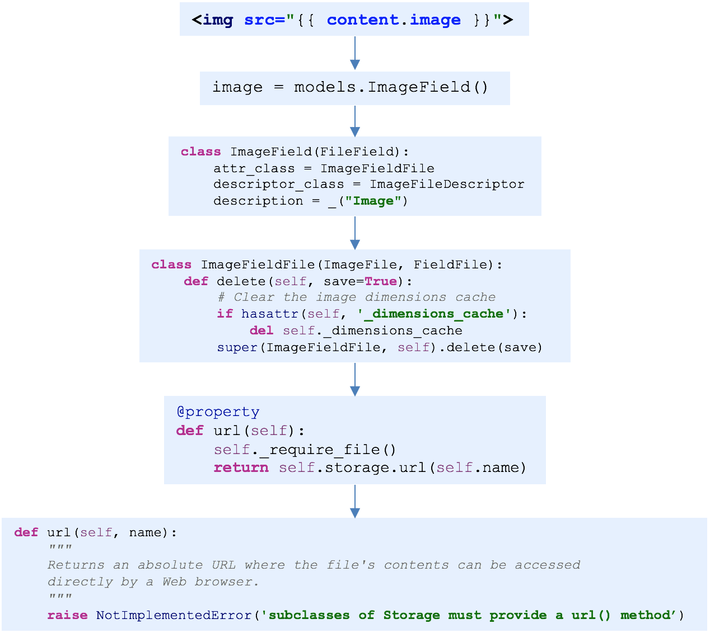

## Django第十二天（商品首页）

#### （一）FastDFS（上传文件）

- 准备工作

  - [Python版本的FastDFS客户端使用参考文档](https://github.com/jefforeilly/fdfs_client-py)

  - 安装包文件

    ```shell
    $ pip install fdfs_client-py-master.zip
    $ pip install mutagen
    $ pip isntall requests
    ```

  - 准备客户端配置文件

    ```shell
    # 1、在utils下创建fastdfs包，将课件中的client.conf拷贝进去
    meiduo_mall.utils.fastdfs.client.conf
    
    # 2、修改配置项
    base_path=FastDFS客户端存放日志文件的目录
    tracker_server=运行Tracker服务的机器ip:22122
    ```

- 使用方式演示

  ```python
  # 0、python manage.py shell
  # 1. 导入FastDFS客户端扩展
  from fdfs_client.client import Fdfs_client
  # 2. 创建FastDFS客户端实例
  client = Fdfs_client('meiduo_mall/utils/fastdfs/client.conf')
  # 3. 调用FastDFS客户端上传文件方法
  ret = client.upload_by_filename('/Users/zhangjie/Desktop/kk.jpeg')
  
  # 返回结果，说明上传成功
  ret = {
  'Group name': 'group1',
  'Remote file_id': 'group1/M00/00/00/wKhnnlxw_gmAcoWmAAEXU5wmjPs35.jpeg',
  'Status': 'Upload successed.',
  'Local file name': '/Users/zhangjie/Desktop/kk.jpeg',
  'Uploaded size': '69.00KB',
  'Storage IP': '192.168.103.158'
   }
  
  # 出现磁盘空间不足bug
  ```

- 上传文件bug解决

  ```shell
  # 1、进入tracker服务器交互模式
  sudo docker exec -it tracker /bin/bash
  
  # 2、进入到/etc/fdfs 目录下
  # 3、修改tracker.conf 
  reserved_storage_space = 10%
  # 4、停止容器
  sudo docker container stop tracker
  # 5、删除容器
  sudo docker container rm tracker
  # 6、重新运行容器
  sudo docker run -dit --name tracker --network=host -v /var/fdfs/tracker:/var/fdfs delron/fastdfs tracker
  ```

- 录入商品数据和图片数据

  - 导入sql数据

    ```shell
    $ mysql -h127.0.0.1 -uroot -pmysql meiduo_mall < 文件路径/goods_data.sql
    ```

  - 导入FDFS图片数据

    ```shell
    # 1、进入到storage目录下
    cd /var/fdfs/storage
    # 2、删除data文件夹
    sudo rm -rf data/
    # 3、将拷贝的data.tar.gz文件解压到/var/fdfs/storage目录下
    sudo tar -zxvf data.tar.gz
    # 4、查看data/00/00/文件夹下是否有图片索引
    ```


#### （二）首页商品

- 首页商品分类数据结构

  ```json
  {
      "1":{
          "channels":[
              {"id":1, "name":"手机", "url":"http://shouji.jd.com/"},
              {"id":2, "name":"相机", "url":"http://www.itcast.cn/"}
          ],
          "sub_cats":[
              {
                  "id":38, 
                  "name":"手机通讯", 
                  "sub_cats":[
                      {"id":115, "name":"手机"},
                      {"id":116, "name":"游戏手机"}
                  ]
              },
              {
                  "id":39, 
                  "name":"手机配件", 
                  "sub_cats":[
                      {"id":119, "name":"手机壳"},
                      {"id":120, "name":"贴膜"}
                  ]
              }
          ]
      }
  }
  ```

- 查询商品分类频道数据

- 二级和三级类别

  ```python
  class IndexView(View):
  
      def get(self, request):
  
          categories = dict()  # categories = {} 只不过是有序的
  
          groups = GoodsChannelGroup.objects.all() 
  
          # 先遍历出11个字典
          for group in groups:
              categories[str(group.id)] = {"channels": [], "sub_cats":[]}
  
          channels = GoodsChannel.objects.order_by("group_id", "sequence")
  
          for channel in channels:
              cat1 = channel.category
              cat1.url = channel.url
              categories[str(channel.group_id)]["channels"].append(cat1)
  
              cat2_list = cat1.subs.all()  # 2级分类列表
              for cat2 in cat2_list:
                  cat2.sub_cats = cat2.subs.all()
  
              categories[str(channel.group_id)]["sub_cats"].extend(cat2_list)
  
  
          context = {
              "categories": categories
          }
          return render(request, "index.html", context)
  ```

- 展示首页商品广告

  ```python
  class IndexView(View):
  
      def get(self, request):
  
   				..........
  
          # 广告数据
          """
          {
              "index_lbt":[
                  {
                      "title":"美图M8s",
                      "url":"http://www.itcast.cn",
                      "image":"group1/M00/00/01/CtM3BVrLmc-AJdVSAAEI5Wm7zaw8639396",
                      "text":""
                  },
                  {
                      "title":"黑色星期五",
                      "url":"http://www.itcast.cn",
                      "image":"group1/M00/00/01/CtM3BVrLmiKANEeLAAFfMRWFbY86177278",
                      "text":""
                  },
                  {
                      "title":"厨卫365",
                      "url":"http://www.itcast.cn",
                      "image":"group1/M00/00/01/CtM3BVrLmkaAPIMJAAESCG7GAh43642702",
                      "text":""
                  },
                  {
                      "title":"君乐宝买一送一",
                      "url":"http://www.itcast.cn",
                      "image":"group1/M00/00/01/CtM3BVrLmnaADtSKAAGlxZuk7uk4998927",
                      "text":""
                  }
              ],
          }
          """
          contents_dict = {}
          content_categories = ContentCategory.objects.all()
          for cat in content_categories:
              """
                  title = models.CharField(max_length=100, verbose_name='标题')
                  url = models.CharField(max_length=300, verbose_name='内容链接')
                  image = models.ImageField(null=True, blank=True, verbose_name='图片')
                  text = models.TextField(null=True, blank=True, verbose_name='内容')
              """
              # contents[cat.key] = cat.content_set.filter(status=True).order_by('sequence')
  
              contents = cat.content_set.filter(status=True).order_by('sequence')
              contents_list = []
              for content in contents:
                  contents_list.append({
                      "title": content.title,
                      "url": content.url,
                      "image": content.image.name,
                      "text": content.text,
                  })
              contents_dict[cat.key] = contents_list
  
          context = {
              "categories": categories,
              "contents": contents_dict
          }
          print(json.dumps(contents_dict))
          return render(request, "index.html", context)
  ```


#### （三）文件存储类（只限于前后端不分离）

- url()方法介绍

  

- 初步实现未优化

  > [自定义文件存储类的官方文档](https://docs.djangoproject.com/en/1.11/howto/custom-file-storage/)

  ```python
  class FastDFSStorage(Storage):
      """自定义文件存储系统"""
  
      def _open(self, name, mode='rb'):
          """
          用于打开文件
          :param name: 要打开的文件的名字
          :param mode: 打开文件方式
          :return: None
          """
          # 打开文件时使用的，此时不需要，而文档告诉说明必须实现，所以pass
          pass
  
      def _save(self, name, content):
          """
          用于保存文件
          :param name: 要保存的文件名字
          :param content: 要保存的文件的内容
          :return: None
          """
          # 保存文件时使用的，此时不需要，而文档告诉说明必须实现，所以pass
          pass
  ```

- 初始化方法优化完成

  ```python
  class FastDFSStorage(Storage):
      """自定义文件存储系统，修改存储的方案"""
      def __init__(self, fdfs_base_url=None):
          """
          构造方法，可以不带参数，也可以携带参数
          :param base_url: Storage的IP
          """
          self.fdfs_base_url = fdfs_base_url or settings.FDFS_BASE_URL
  
      def _open(self, name, mode='rb'):
          ......
  
      def _save(self, name, content):
          ......
  
      def url(self, name):
          """
          返回name所指文件的绝对URL
          :param name: 要读取文件的引用:group1/M00/00/00/wKhnnlxw_gmAcoWmAAEXU5wmjPs35.jpeg
          :return: http://192.168.103.158:8888/group1/M00/00/00/wKhnnlxw_gmAcoWmAAEXU5wmjPs35.jpeg
          """
          # return 'http://192.168.103.158:8888/' + name
          # return 'http://image.meiduo.site:8888/' + name
          return self.fdfs_base_url + name
  
  
  # 指定自定义的Django文件存储类
  DEFAULT_FILE_STORAGE = 'meiduo_mall.utils.fastdfs.fdfs_storage.FastDFSStorage'
  
  # FastDFS相关参数
  # FDFS_BASE_URL = 'http://192.168.103.158:8888/'
  FDFS_BASE_URL = 'http://image.meiduo.site:8888/'
  ```


