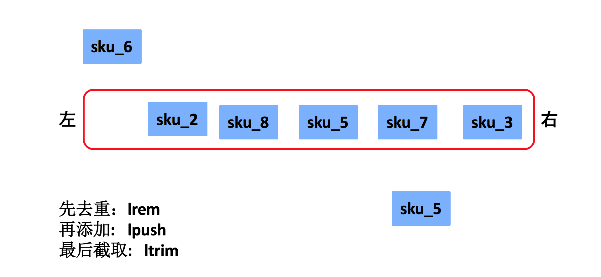

## Django第十四天（商品详情页和购物车）

#### （一）商品详情页（重复的工作）

- 接口设计和定义

  > **1.请求方式**

  | 选项         | 方案                     |
  | ------------ | ------------------------ |
  | **请求方法** | GET                      |
  | **请求地址** | /detail/(?P<sku_id>\d+)/ |

  > **2.请求参数：路径参数**

  | 参数名     | 类型   | 是否必传 | 说明        |
  | ---------- | ------ | -------- | ----------- |
  | **sku_id** | string | 是       | 商品SKU编号 |

  > **3.响应结果：HTML**

  ```python
  detail.html
  ```

  > **4.接口定义**

  ```python
  class DetailView(View):
      """商品详情页"""
  
      def get(self, request, sku_id):
          """提供商品详情页"""
          return render(request, 'detail.html')
  ```

- 面包屑导航+热销排行

  ```python
  class DetailView(View):
      """商品详情页"""
  
      def get(self, request, sku_id):
          """提供商品详情页"""
          # 获取当前sku的信息
          try:
              sku = models.SKU.objects.get(id=sku_id)
          except models.SKU.DoesNotExist:
              return render(request, '404.html')
  
          # 查询商品频道分类
          categories = get_categories()
          # 查询面包屑导航
          breadcrumb = get_breadcrumb(sku.category)
  
          # 渲染页面
          context = {
              'categories':categories,
              'breadcrumb':breadcrumb,
              'sku':sku,
          }
          return render(request, 'detail.html', context)
  ```

- SKU和规格数据（最后一天）

####（二）3级分类下的商品访问量（逻辑简单）

- 接口设计和定义

  > **1.请求方式**

  | 选项         | 方案                                |
  | ------------ | ----------------------------------- |
  | **请求方法** | POST                                |
  | **请求地址** | /detail/visit/(?P<category_id>\d+)/ |

  > **2.请求参数：路径参数**

  | 参数名          | 类型   | 是否必传 | 说明                   |
  | --------------- | ------ | -------- | ---------------------- |
  | **category_id** | string | 是       | 商品分类ID，第三级分类 |

  > **3.响应结果：JSON**

  | 字段       | 说明     |
  | ---------- | -------- |
  | **code**   | 状态码   |
  | **errmsg** | 错误信息 |

  > **4.后端接口定义和实现**，
  >
  > - 如果访问记录存在，说明今天不是第一次访问，不新建记录，访问量直接累加。
  > - 如果访问记录不存在，说明今天是第一次访问，新建记录并保存访问量。

  ```python
  class GoodsVisitCount(BaseModel):
      """统计分类商品访问量模型类"""
      category = models.ForeignKey(GoodsCategory, on_delete=models.CASCADE, verbose_name='商品分类')
      count = models.IntegerField(verbose_name='访问量', default=0)
      date = models.DateField(auto_now_add=True, verbose_name='统计日期')
  
      class Meta:
          db_table = 'tb_goods_visit'
  ```

- 后端逻辑实现

  ```python
  class DetailVisitView(View):
      """详情页分类商品访问量"""
  
      def post(self, request, category_id):
          """记录分类商品访问量"""
          try:
              category = models.GoodsCategory.objects.get(id=category_id)
          except models.GoodsCategory.DoesNotExist:
              return http.HttpResponseForbidden('缺少必传参数')
  
          # 获取今天的日期
          t = timezone.localtime()
          today_str = '%d-%02d-%02d' % (t.year, t.month, t.day)
          today_date = datetime.datetime.strptime(today_str, '%Y-%m-%d')
          try:
              # 查询今天该类别的商品的访问量
              counts_data = category.goodsvisitcount_set.get(date=today_date)
          except models.GoodsVisitCount.DoesNotExist:
              # 如果该类别的商品在今天没有过访问记录，就新建一个访问记录
              counts_data = models.GoodsVisitCount()
  
          try:
              counts_data.category = category
              counts_data.count += 1
              counts_data.save()
          except Exception as e:
              logger.error(e)
              return http.HttpResponseServerError('服务器异常')
  
          return http.JsonResponse({'code': RETCODE.OK, 'errmsg': 'OK'})
  ```

  ```python
  # 1、我该如何获取今天的日期字符串"2019-10-11"
  # 2、如何将"2019-10-11"转化为日期对象
  
  In [1]: "2019-01-01" > "2018-01-01"                                             
  Out[1]: True
  
  In [2]: from datetime import datetime                                           
  
  In [3]: today_date_obj = datetime.now()                                         
  
  In [4]: today_date_obj                                                          
  Out[4]: datetime.datetime(2019, 10, 11, 10, 54, 12, 208047)
  
  In [5]: today_date_obj > "2019-01-01"                                           
  ---------------------------------------------------------------------------
  TypeError                                 Traceback (most recent call last)
  <ipython-input-5-ffe9f70d7cf3> in <module>
  ----> 1 today_date_obj > "2019-01-01"
  
  TypeError: '>' not supported between instances of 'datetime.datetime' and 'str'
  
  In [6]: today_date_str = "%d-%02d-%02d"% (today_date_obj.year, today_date_obj.mo
     ...: nth, today_date_obj.day)                                                
  
  In [7]: today_date_str                                                          
  Out[7]: '2019-10-11'
  
  In [8]: today_date_obj2 = datetime.strptime(today_date_str, '%Y-%m-%d')         
  
  In [9]: today_date_obj2                                                         
  Out[9]: datetime.datetime(2019, 10, 11, 0, 0)
  ```

- 列表页跳转到详情页（略）

####（三）商品浏览记录（重点）

- 浏览记录存储方案

  - 浏览记录存什么？

    > user_id.  sku_id

  - 浏览记录存哪里？

    > mysql需要建表，占用磁盘空间；数据量少

  - 浏览记录怎么存？

    

    > 列表  自带排序功能（lpush）， 列表的删除可以实现去重（lrem），列表可以截取（ltrim）。

- 保存浏览记录

  > **1.请求方式**

  | 选项         | 方案               |
  | ------------ | ------------------ |
  | **请求方法** | POST               |
  | **请求地址** | /browse_histories/ |

  > **2.请求参数：JSON**

  | 参数名     | 类型   | 是否必传 | 说明        |
  | ---------- | ------ | -------- | ----------- |
  | **sku_id** | string | 是       | 商品SKU编号 |

  > **3.响应结果：JSON**

  | 字段       | 说明     |
  | ---------- | -------- |
  | **code**   | 状态码   |
  | **errmsg** | 错误信息 |

  > **4.后端接口定义和实现**

  ```python
  class UserBrowseHistory(LoginRequiredJSONMixin, View):
      """用户浏览记录"""
  
      def post(self, request):
          """保存用户浏览记录"""
          # 接收参数
          json_dict = json.loads(request.body.decode())
          sku_id = json_dict.get('sku_id')
  
          # 校验参数
          try:
              models.SKU.objects.get(id=sku_id)
          except models.SKU.DoesNotExist:
              return http.HttpResponseForbidden('sku不存在')
  
          # 保存用户浏览数据
          redis_conn = get_redis_connection('history')
          pl = redis_conn.pipeline()
          user_id = request.user.id
  
          # 先去重
          pl.lrem('history_%s' % user_id, 0, sku_id)
          # 再存储
          pl.lpush('history_%s' % user_id, sku_id)
          # 最后截取
          pl.ltrim('history_%s' % user_id, 0, 4)
          # 执行管道
          pl.execute()
  
          # 响应结果
          return http.JsonResponse({'code': RETCODE.OK, 'errmsg': 'OK'})
  ```

- 查询浏览记录

  > **1.请求方式**

  | 选项         | 方案               |
  | ------------ | ------------------ |
  | **请求方法** | GET                |
  | **请求地址** | /browse_histories/ |

  > **2.请求参数：**

  ```
  无
  ```

  > **3.响应结果：JSON**

  | 字段                  | 说明            |
  | --------------------- | --------------- |
  | **code**              | 状态码          |
  | **errmsg**            | 错误信息        |
  | **skus[ ]**           | 商品SKU列表数据 |
  | **id**                | 商品SKU编号     |
  | **name**              | 商品SKU名称     |
  | **default_image_url** | 商品SKU默认图片 |
  | **price**             | 商品SKU单价     |

  ```json
  {
      "code":"0",
      "errmsg":"OK",
      "skus":[
          {
              "id":6,
              "name":"Apple iPhone 8 Plus (A1864) 256GB 深空灰色 移动联通电信4G手机",
              "default_image_url":"http://image.meiduo.site:8888/group1/M00/00/02/CtM3BVrRbI2ARekNAAFZsBqChgk3141998",
              "price":"7988.00"
          },
          ......
      ]
  }
  ```

  > **4.后端接口定义和实现**

  ```python
  class UserBrowseHistory(LoginRequiredJSONMixin, View):
      """用户浏览记录"""
  
      def get(self, request):
          """获取用户浏览记录"""
          # 获取Redis存储的sku_id列表信息
          redis_conn = get_redis_connection('history')
          sku_ids = redis_conn.lrange('history_%s' % request.user.id, 0, -1)
  
          # 根据sku_ids列表数据，查询出商品sku信息
          skus = []
          for sku_id in sku_ids:
              sku = models.SKU.objects.get(id=sku_id)
              skus.append({
                  'id': sku.id,
                  'name': sku.name,
                  'default_image_url': sku.default_image.url,
                  'price': sku.price
              })
  
          return http.JsonResponse({'code': RETCODE.OK, 'errmsg': 'OK', 'skus': skus})
  ```

#### （四）购物车（重点+数据的存储（redis））

- 登录用户购物车存储方案

  - **存储数据：user_id、sku_id、count、selected**
  - **存储位置：Redis数据库**
    - 购物车数据量小，结构简单，更新频繁，所以我们选择内存型数据库Redis进行存储
  - **hash**存储商品数量
    - carts_user_id: {sku_id1: count, sku_id3: count, sku_id5: count, ...}
  - set存储勾选状态
    - selected_user_id: {sku_id1, sku_id3, …}

- 未登录用户购物车存储方案

  - **存储数据：sku_id、count、selected**

  - **存储位置：用户浏览器的cookie**

  - json字符串

    ```json
    {
        "sku_id1":{
            "count":"1",
            "selected":"True"
        },
        "sku_id3":{
            "count":"3",
            "selected":"True"
        },
    }
    ```

  - 解决方案：**pickle模块** 和 **base64模块**，进行签名（itsdangrous）

- 保存购物车-接口设计和定义

  > **1.请求方式**

  | 选项         | 方案    |
  | ------------ | ------- |
  | **请求方法** | POST    |
  | **请求地址** | /carts/ |

  > **2.请求参数：JSON**

  | 参数名       | 类型 | 是否必传 | 说明        |
  | ------------ | ---- | -------- | ----------- |
  | **sku_id**   | int  | 是       | 商品SKU编号 |
  | **count**    | int  | 是       | 商品数量    |
  | **selected** | bool | 否       | 是否勾选    |

  > **3.响应结果：JSON**

  | 字段       | 说明     |
  | ---------- | -------- |
  | **code**   | 状态码   |
  | **errmsg** | 错误信息 |

- 保存购物车-接受和校验参数

- 保存购物车-判断用户是否登录

  ```python
  class CartsView(View):
      """购物车管理"""
  
      def post(self, request):
          """添加购物车"""
          # 接收参数
          json_dict = json.loads(request.body.decode())
          sku_id = json_dict.get('sku_id')
          count = json_dict.get('count')
          selected = json_dict.get('selected', True)
  
          # 判断参数是否齐全
          if not all([sku_id, count]):
              return http.HttpResponseForbidden('缺少必传参数')
          # 判断sku_id是否存在
          try:
              models.SKU.objects.get(id=sku_id)
          except models.SKU.DoesNotExist:
              return http.HttpResponseForbidden('商品不存在')
          # 判断count是否为数字
          try:
              count = int(count)
          except Exception:
              return http.HttpResponseForbidden('参数count有误')
          # 判断selected是否为bool值
          if not isinstance(selected, bool):
            return http.HttpResponseForbidden('参数selected有误')
  
          # 判断用户是否登录
          user = request.user
          if user.is_authenticated:
              # 用户已登录，操作redis购物车
              pass
          else:
              # 用户未登录，操作cookie购物车
              pass
  ```


