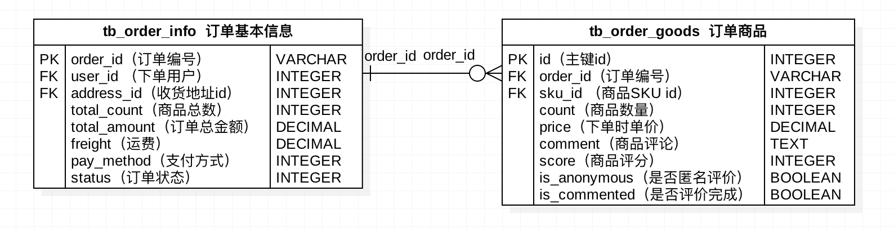
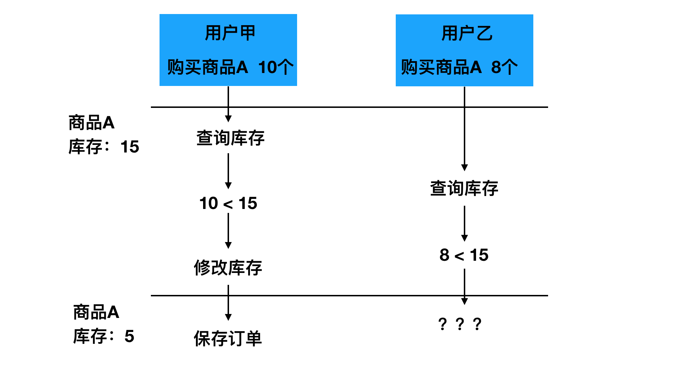
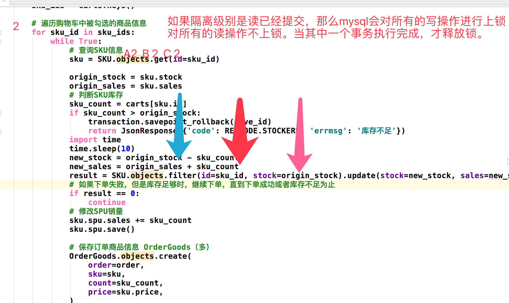
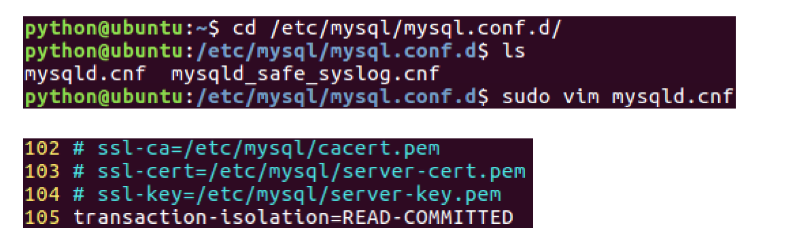
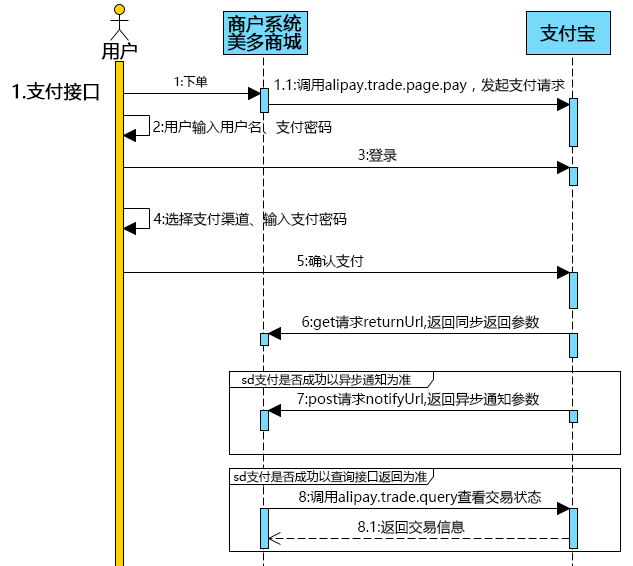

## Django第十六天（订单和支付）

#### （一）订单显示

- 后端接口准备

  > **请求方式**

  | 选项         | 方案                |
  | ------------ | ------------------- |
  | **请求方法** | GET                 |
  | **请求地址** | /orders/settlement/ |

  > **2.请求参数：**

  ```
  无
  ```

  > **3.响应结果：HTML**

  ```
  place_order.html
  ```

  > **4.后端接口定义**

  ```python
  class OrderSettlementView(LoginRequiredMixin, View):
      """结算订单"""
  
      def get(self, request):
          """提供订单结算页面"""
          return render(request, 'place_order.html')
  ```

- 后端逻辑实现

  ```python
  class OrderSettlementView(LoginRequiredMixin, View):
      """结算订单"""
  
      def get(self, request):
          """提供订单结算页面"""
          # 获取登录用户
          user = request.user
          # 查询地址信息
          try:
              addresses = Address.objects.filter(user=request.user, is_deleted=False)
          except Address.DoesNotExist:
              # 如果地址为空，渲染模板时会判断，并跳转到地址编辑页面
              addresses = None
  
          # 从Redis购物车中查询出被勾选的商品信息
          redis_conn = get_redis_connection('carts')
          redis_cart = redis_conn.hgetall('carts_%s' % user.id)
          cart_selected = redis_conn.smembers('selected_%s' % user.id)
          cart = {}
          for sku_id in cart_selected:
              cart[int(sku_id)] = int(redis_cart[sku_id])
  
          # 准备初始值
          total_count = 0
          total_amount = Decimal(0.00)
          # 查询商品信息
          skus = SKU.objects.filter(id__in=cart.keys())
          for sku in skus:
              sku.count = cart[sku.id]
              sku.amount = sku.count * sku.price
              # 计算总数量和总金额
              total_count += sku.count
              total_amount += sku.count * sku.price
          # 补充运费
          freight = Decimal('10.00')
  
          # 渲染界面
          context = {
              'addresses': addresses,
              'skus': skus,
              'total_count': total_count,
              'total_amount': total_amount,
              'freight': freight,
              'payment_amount':total_amount + freight
          }
  
          return render(request, 'place_order.html', context)
  ```

  

#### （二）提交订单

- 订单数据表的创建

  - 订单号不再采用数据库自增主键，而是由后端生成。

  - 一个订单中可以有多个商品信息，订单基本信息和订单商品信息是一对多的关系。

    

- 保存订单基本信息

  > **1.请求方式**

  | 选项         | 方案            |
  | ------------ | --------------- |
  | **请求方法** | POST            |
  | **请求地址** | /orders/commit/ |

  > **2.请求参数：JSON**

  | 参数名         | 类型 | 是否必传 | 说明         |
  | -------------- | ---- | -------- | ------------ |
  | **address_id** | int  | 是       | 用户地址编号 |
  | **pay_method** | int  | 是       | 用户支付方式 |

  > **3.响应结果：JSON**

  | 字段         | 说明     |
  | ------------ | -------- |
  | **code**     | 状态码   |
  | **errmsg**   | 错误信息 |
  | **order_id** | 订单编号 |

  > **4.后端接口定义**

  ```python
  class OrderCommitView(LoginRequiredJSONMixin, View):
      """订单提交"""
  
      def post(self, request):
          """保存订单信息和订单商品信息"""
          pass
  ```

  > 提示：
  >
  > - 订单数据分为订单基本信息和订单商品信息，二者为一对多的关系。
  > - 保存到订单的数据是从Redis购物车中的已勾选的商品信息。

  ```python
  class OrderCommitView(LoginRequiredJSONMixin, View):
      """提交订单"""
  
      def post(self, request):
          """保存订单信息和订单商品信息"""
          # 获取当前要保存的订单数据
          json_dict = json.loads(request.body.decode())
          address_id = json_dict.get('address_id')
          pay_method = json_dict.get('pay_method')
          # 校验参数
          if not all([address_id, pay_method]):
              return http.HttpResponseForbidden('缺少必传参数')
          # 判断address_id是否合法
          try:
              address = Address.objects.get(id=address_id)
          except Exception:
              return http.HttpResponseForbidden('参数address_id错误')
          # 判断pay_method是否合法
          if pay_method not in [OrderInfo.PAY_METHODS_ENUM['CASH'], OrderInfo.PAY_METHODS_ENUM['ALIPAY']]:
              return http.HttpResponseForbidden('参数pay_method错误')
  
          # 获取登录用户
          user = request.user
          # 生成订单编号：年月日时分秒+用户编号
          order_id = timezone.localtime().strftime('%Y%m%d%H%M%S') + ('%09d' % user.id)
          # 保存订单基本信息 OrderInfo（一）
          order = OrderInfo.objects.create(
              order_id=order_id,
              user=user,
              address=address,
              total_count=0,
              total_amount=Decimal('0'),
              freight=Decimal('10.00'),
              pay_method=pay_method,
              status=OrderInfo.ORDER_STATUS_ENUM['UNPAID'] if pay_method == OrderInfo.PAY_METHODS_ENUM['ALIPAY'] else
              OrderInfo.ORDER_STATUS_ENUM['UNSEND']
          )
          pass
  ```

- 保存订单商品信息

  ```python
  class OrderCommitView(LoginRequiredJSONMixin, View):
      """提交订单"""
  
      def post(self, request):
          """保存订单信息和订单商品信息"""
          # 获取当前保存订单时需要的信息
          ......
  
          # 保存订单基本信息 OrderInfo（一）
          ......
  
          # 从redis读取购物车中被勾选的商品信息
          redis_conn = get_redis_connection('carts')
          redis_cart = redis_conn.hgetall('carts_%s' % user.id)
          selected = redis_conn.smembers('selected_%s' % user.id)
          carts = {}
          for sku_id in selected:
              carts[int(sku_id)] = int(redis_cart[sku_id])
          sku_ids = carts.keys()
  
          # 遍历购物车中被勾选的商品信息
          for sku_id in sku_ids:
              # 查询SKU信息
              sku = SKU.objects.get(id=sku_id)
              # 判断SKU库存
              sku_count = carts[sku.id]
              if sku_count > sku.stock:
                  return http.JsonResponse({'code': RETCODE.STOCKERR, 'errmsg': '库存不足'})
  
              # SKU减少库存，增加销量
              sku.stock -= sku_count
              sku.sales += sku_count
              sku.save()
  
              # 修改SPU销量
              sku.spu.sales += sku_count
              sku.spu.save()
  
              # 保存订单商品信息 OrderGoods（多）
              OrderGoods.objects.create(
                  order=order,
                  sku=sku,
                  count=sku_count,
                  price=sku.price,
              )
  
              # 保存商品订单中总价和总数量
              order.total_count += sku_count
              order.total_amount += (sku_count * sku.price)
  
          # 添加邮费和保存订单信息
          order.total_amount += order.freight
          order.save()
  
          # 清除购物车中已结算的商品
          pl = redis_conn.pipeline()
          pl.hdel('carts_%s' % user.id, *selected)
          pl.srem('selected_%s' % user.id, *selected)
          pl.execute()
  
          # 响应提交订单结果
          return http.JsonResponse({'code': RETCODE.OK, 'errmsg': '下单成功', 'order_id': order.order_id})
  ```

  

- 展示提交订单成功页面

  > **1.请求方式**

  | 选项         | 方案             |
  | ------------ | ---------------- |
  | **请求方法** | GET              |
  | **请求地址** | /orders/success/ |

  > **2.请求参数：**

  ```
  无
  ```

  > **3.响应结果：HTML**

  ```
  order_success.html
  ```

  > **4.后端接口定义和实现**

  ```python
  class OrderSuccessView(LoginRequiredMixin, View):
      """提交订单成功"""
  
      def get(self, request):
          order_id = request.GET.get('order_id')
          payment_amount = request.GET.get('payment_amount')
          pay_method = request.GET.get('pay_method')
  
          context = {
              'order_id':order_id,
              'payment_amount':payment_amount,
              'pay_method':pay_method
          }
          return render(request, 'order_success.html', context)
  ```

#### （三）django中事务

- Django中事务的使用

  - **装饰器用法：**整个视图中所有MySQL数据库的操作都看做一个事务，范围太大，不够灵活。而且无法直接作用于类视图。

    ```python
    from django.db import transaction
    
    @transaction.atomic
    def viewfunc(request):
      # 这些代码会在一个事务中执行
      ......
    ```

    

  - **with语句用法：**可以灵活的有选择性的把某些MySQL数据库的操作看做一个事务。而且不用关心视图的类型。

    ```python
    from django.db import transaction
    
    def viewfunc(request):
      # 这部分代码不在事务中，会被Django自动提交
      ......
    
      with transaction.atomic():
          # 这部分代码会在事务中执行
          ......
    ```

  

  - 保存点的设置

    ```python
    from django.db import transaction
    
    # 创建保存点
    save_id = transaction.savepoint()  
    # 回滚到保存点
    transaction.savepoint_rollback(save_id)
    # 提交从保存点到当前状态的所有数据库事务操作
    transaction.savepoint_commit(save_id)
    ```

- 使用事务保存订单数据

  ```python
  class OrderCommitView(LoginRequiredJSONMixin, View):
      """订单提交"""
  
      def post(self, request):
          """保存订单信息和订单商品信息"""
          # 获取当前保存订单时需要的信息
          ......
  
          # 显式的开启一个事务
          with transaction.atomic():
              # 创建事务保存点
              save_id = transaction.savepoint()
  
              # 暴力回滚
              try:
                  # 保存订单基本信息 OrderInfo（一）
                  order = OrderInfo.objects.create()
                  ......
                  # 遍历购物车中被勾选的商品信息
                  for sku_id in sku_ids:
                      # 查询SKU信息
                      sku = SKU.objects.get(id=sku_id)
                      # 判断SKU库存
                      sku_count = carts[sku.id]
                      if sku_count > sku.stock:
                          # 出错就回滚
                          transaction.savepoint_rollback(save_id)
                          return http.JsonResponse({'code': RETCODE.STOCKERR, 'errmsg': '库存不足'})						......
              except Exception as e:
                  logger.error(e)
                  transaction.savepoint_rollback(save_id)
                  return http.JsonResponse({'code': RETCODE.DBERR, 'errmsg': '下单失败'})
  
              # 提交订单成功，显式的提交一次事务
              transaction.savepoint_commit(save_id)
  
        	......
          # 响应提交订单结果
          return http.JsonResponse({'code': RETCODE.OK, 'errmsg': '下单成功', 'order_id': order.order_id})
  
  ```

  

#### （四）并发抢单（难点）

- 并发下单问题演示和解决方案

  

  - 悲观锁

    - 当查询某条记录时，即让数据库为该记录加锁，锁住记录后别人无法操作，使用类似如下语法

      ```python
      select stock from tb_sku where id=1 for update;
      
      SKU.objects.select_for_update().get(id=1)
      ```

    - 悲观锁类似于我们在多线程资源竞争时添加的互斥锁，容易出现死锁现象，采用不多。

  - 乐观锁

    - 乐观锁并不是真实存在的锁，而是在更新的时候判断此时的库存是否是之前查询出的库存，如果相同，表示没人修改，可以更新库存，否则表示别人抢过资源，不再执行库存更新。类似如下操作

      ```python
      update tb_sku set stock=2 where id=1 and stock=7;
      
      SKU.objects.filter(id=1, stock=7).update(stock=2)
      ```

  - 任务队列

    - 将下单的逻辑放到任务队列中（如celery），将并行转为串行，所有人排队下单。比如开启只有一个进程的Celery，一个订单一个订单的处理。

- 使用乐观锁并发下单

  

- MySQL事务隔离级别

  - `Serializable`：串行化，一个事务一个事务的执行。
  - `Repeatable read`：可重复读，无论其他事务是否修改并提交了数据，在这个事务中看到的数据值始终不受其他事务影响。
  - `Read committed`：读取已提交，其他事务提交了对数据的修改后，本事务就能读取到修改后的数据值。
  - `Read uncommitted`：读取未提交，其他事务只要修改了数据，即使未提交，本事务也能看到修改后的数据值。

  

#### （五）支付宝

- 沙箱介绍

  - https://open.alipay.com/platform/home.htm（支付宝开放平台）
  - https://openhome.alipay.com/platform/appDaily.htm?tab=info（沙箱应用）
  - https://openhome.alipay.com/platform/appDaily.htm?tab=account（沙箱账号）

- 快速接入介绍

  - 创建应用

  - 配置应用

  - 配置秘钥

  - 集成SDK

  - 接口调用

    

- SDK和API

  - 文档主页：https://openhome.alipay.com/developmentDocument.htm

  - 电脑网站支付产品介绍：https://docs.open.alipay.com/270

  - 电脑网站支付快速接入：https://docs.open.alipay.com/270/105899/

  - API列表：https://docs.open.alipay.com/270/105900/

  - SDK文档：https://docs.open.alipay.com/270/106291/

  - Python支付宝SDK：

    https://github.com/fzlee/alipay/blob/master/README.zh-hans.md

    - SDK安装：`pip install python-alipay-sdk --upgrade`

- 配置密钥

  - 生成秘钥

    ```shell
    $ openssl
    $ OpenSSL> genrsa -out app_private_key.pem 2048  # 制作私钥RSA2
    $ OpenSSL> rsa -in app_private_key.pem -pubout -out app_public_key.pem # 导出公钥
    $ OpenSSL> exit
    ```

  - **配置美多商城公私钥**

    - 新建子应用`payment`,在该子应用下新建文件夹`keys`用于存储公私钥。
    - 将制作的美多商城私钥`app_private_key.pem`拷贝到`keys`文件夹中。

  - 配置美多商城公钥
    - 将`payment.keys.app_public_key.pem`文件中内容上传到支付宝。
  - 配置支付宝公钥
    - 将支付宝公钥内容拷贝到`payment.keys.alipay_public_key.pem`文件中。

- 订单支付

  ```python
  class PaymentView(LoginRequiredJSONMixin, View):
      """订单支付功能"""
  
      def get(self,request, order_id):
          # 查询要支付的订单
          user = request.user
          try:
              order = OrderInfo.objects.get(order_id=order_id, user=user, status=OrderInfo.ORDER_STATUS_ENUM['UNPAID'])
          except OrderInfo.DoesNotExist:
              return http.HttpResponseForbidden('订单信息错误')
  
          # 创建支付宝支付对象
          alipay = AliPay(
              appid=settings.ALIPAY_APPID,
              app_notify_url=None,  # 默认回调url
              app_private_key_path=os.path.join(os.path.dirname(os.path.abspath(__file__)), "keys/app_private_key.pem"),
              alipay_public_key_path=os.path.join(os.path.dirname(os.path.abspath(__file__)), "keys/alipay_public_key.pem"),
              sign_type="RSA2",
              debug=settings.ALIPAY_DEBUG
          )
  
          # 生成登录支付宝连接
          order_string = alipay.api_alipay_trade_page_pay(
              out_trade_no=order_id,
              total_amount=str(order.total_amount),
              subject="美多商城%s" % order_id,
              return_url=settings.ALIPAY_RETURN_URL,
          )
  
          # 响应登录支付宝连接
          # 真实环境电脑网站支付网关：https://openapi.alipay.com/gateway.do? + order_string
          # 沙箱环境电脑网站支付网关：https://openapi.alipaydev.com/gateway.do? + order_string
          alipay_url = settings.ALIPAY_URL + "?" + order_string
          return http.JsonResponse({'code': RETCODE.OK, 'errmsg': 'OK', 'alipay_url': alipay_url})
  ```

  ```python
  ALIPAY_APPID = '2016082100308405'
  ALIPAY_DEBUG = True
  ALIPAY_URL = 'https://openapi.alipaydev.com/gateway.do'
  ALIPAY_RETURN_URL = 'http://www.meiduo.site:8000/payment/status/'
  ```

  

- 保存订单支付结果

  - 定义支付结果模型类

    ```python
    class Payment(BaseModel):
        """支付信息"""
        order = models.ForeignKey(OrderInfo, on_delete=models.CASCADE, verbose_name='订单')
        trade_id = models.CharField(max_length=100, unique=True, null=True, blank=True, verbose_name="支付编号")
    
        class Meta:
            db_table = 'tb_payment'
            verbose_name = '支付信息'
            verbose_name_plural = verbose_name
    ```

  - 保存订单结果

    > **1.请求方式**

    | 选项         | 方案             |
    | ------------ | ---------------- |
    | **请求方法** | GET              |
    | **请求地址** | /payment/status/ |

    > **2.请求参数：路径参数**

    ```
    参考统一收单下单并支付页面接口中的《页面回跳参数》
    ```

    > **3.响应结果：HTML**

    ```
    pay_success.html
    ```

    > **4.后端接口定义和实现**
    >
    > 注意：保存订单支付结果的同时，还需要修改订单的状态为**待评价**

    ```python
    # 测试账号：pqcanx4910@sandbox.com
    class PaymentStatusView(View):
        """保存订单支付结果"""
    
        def get(self, request):
            # 获取前端传入的请求参数
            query_dict = request.GET
            data = query_dict.dict()
            # 获取并从请求参数中剔除signature
            signature = data.pop('sign')
    
            # 创建支付宝支付对象
            alipay = AliPay(
                appid=settings.ALIPAY_APPID,
                app_notify_url=None,
                app_private_key_path=os.path.join(os.path.dirname(os.path.abspath(__file__)), "keys/app_private_key.pem"),
                alipay_public_key_path=os.path.join(os.path.dirname(os.path.abspath(__file__)), "keys/alipay_public_key.pem"),
                sign_type="RSA2",
                debug=settings.ALIPAY_DEBUG
            )
            # 校验这个重定向是否是alipay重定向过来的
            success = alipay.verify(data, signature)
            if success:
                # 读取order_id
                order_id = data.get('out_trade_no')
                # 读取支付宝流水号
                trade_id = data.get('trade_no')
                # 保存Payment模型类数据
                Payment.objects.create(
                    order_id=order_id,
                    trade_id=trade_id
                )
    
                # 修改订单状态为待评价
                OrderInfo.objects.filter(order_id=order_id, status=OrderInfo.ORDER_STATUS_ENUM['UNPAID']).update(
                    status=OrderInfo.ORDER_STATUS_ENUM["UNCOMMENT"])
    
                # 响应trade_id
                context = {
                    'trade_id':trade_id
                }
                return render(request, 'pay_success.html', context)
            else:
                # 订单支付失败，重定向到我的订单
                return http.HttpResponseForbidden('非法请求')
    ```

