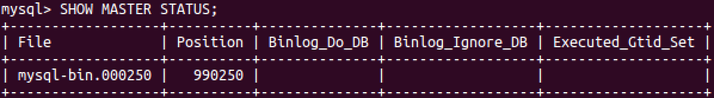

## Django第十七天（性能优化）

#### （一）页面静态化

- 页面静态化介绍

  - 为什要静态化
    - 减少数据库查询次数。
    - 提升页面响应效率。
    - 提高用户体验
  - 页面静态化注意点
    - 用户相关数据不能静态化：
      - 用户名、购物车等不能静态化。
    - 动态变化的数据不能静态化：
      - 热销排行、新品推荐、分页排序数据等等。
    - 不能静态化的数据处理：
      - 可以在用户得到页面后，在页面中向后端发送Ajax请求获取相关数据。
      - 直接使用模板渲染出来。
      - 其他合理的处理方式等等。

- 广告页面静态化-工具方法静态化实现

  ```python
  定时时间基本格式 :
  
  *  *  *  *  *
  
  分 时 日 月 周    命令
  
  M: 分钟（0-59）。每分钟用 * 或者 */1 表示
  H：小时（0-23）。（0表示0点）
  D：天（1-31）。
  m: 月（1-12）。
  d: 一星期内的天（0~6，0为星期天）。
  ```

  ```python
  def generate_static_index_html():
      """
      生成静态的主页html文件
      """
      import time
      print('%s: generate_static_index_html' % time.ctime())
  
      # 获取商品频道和分类
      categories = get_categories()
  
      # 广告内容
      contents = {}
      content_categories = ContentCategory.objects.all()
      for cat in content_categories:
          contents[cat.key] = cat.content_set.filter(status=True).order_by('sequence')
  
      # 渲染模板
      context = {
          'categories': categories,
          'contents': contents
      }
  
      # 获取首页模板文件
      template = loader.get_template('index.html')
      # 渲染首页html字符串
      html_text = template.render(context)
      # 将首页html字符串写入到指定目录，命名'index.html'
      file_path = os.path.join(settings.STATICFILES_DIRS[0], 'index.html')
      with open(file_path, 'w', encoding='utf-8') as f:
          f.write(html_text)
          
          
  # 进入到static上级目录
  $ cd ~/projects/meiduo_project/meiduo_mall/meiduo_mall
  # 开启测试静态服务器
  $ python -m http.server 8080 --bind 127.0.0.1
  ```

  

- 广告页面静态化-定时任务静态化首页

  ```python
  # 1、安装扩展包
  pip install django-crontab
  # 2、注册应用
  INSTALLED_APPS = [    
      'django_crontab', # 定时任务
  ]
  # 3、配置文件中添加任务
  
  '* * * * * * sleep 1' 
  
  CRONJOBS = [
      # 每1分钟生成一次首页静态文件
      ('*/1 * * * *', 'contents.crons.generate_static_index_html', '>> ' + os.path.join(os.path.dirname(BASE_DIR), 'logs/crontab.log'))
  ]
  CRONTAB_COMMAND_PREFIX = 'LANG_ALL=zh_cn.UTF-8'
  
  # 4、管理任务
  # 添加定时任务到系统中
  $ python manage.py crontab add
  
  # 显示已激活的定时任务
  $ python manage.py crontab show
  
  # 移除定时任务
  $ python manage.py crontab remove
  
  ```

  

- 详情页面静态化-静态化方案说明

  - 商品详情页查询数据量大，而且是用户频繁访问的页面。
  - 类似首页广告，为了减少数据库查询次数，提升页面响应效率，我们也要对详情页进行静态化处理。
  - 方案一：通过Python脚本手动一次性批量生成所有商品静态详情页。
  - 方案二：后台运营人员修改了SKU信息时，异步的静态化对应的商品详情页面。

- 详情页面静态化-python脚本批量静态化

  ```python
  #!/usr/bin/env python
  
  import sys
  sys.path.insert(0, '../')
  
  import os
  if not os.getenv('DJANGO_SETTINGS_MODULE'):
      os.environ['DJANGO_SETTINGS_MODULE'] = 'meiduo_mall.settings.dev'
  
  import django
  django.setup()
  
  from django.template import loader
  from django.conf import settings
  
  from goods import models
  from contents.utils import get_categories
  from goods.utils import get_breadcrumb
  
  
  def generate_static_sku_detail_html(sku_id):
      """
      生成静态商品详情页面
      :param sku_id: 商品sku id
      """
      # 获取当前sku的信息
      sku = models.SKU.objects.get(id=sku_id)
  
      # 查询商品频道分类
      categories = get_categories()
      # 查询面包屑导航
      breadcrumb = get_breadcrumb(sku.category)
  
      # 构建当前商品的规格键
      sku_specs = sku.specs.order_by('spec_id')
      sku_key = []
      for spec in sku_specs:
          sku_key.append(spec.option.id)
      # 获取当前商品的所有SKU
      skus = sku.spu.sku_set.all()
      # 构建不同规格参数（选项）的sku字典
      spec_sku_map = {}
      for s in skus:
          # 获取sku的规格参数
          s_specs = s.specs.order_by('spec_id')
          # 用于形成规格参数-sku字典的键
          key = []
          for spec in s_specs:
              key.append(spec.option.id)
          # 向规格参数-sku字典添加记录
          spec_sku_map[tuple(key)] = s.id
      # 获取当前商品的规格信息
      goods_specs = sku.spu.specs.order_by('id')
      # 若当前sku的规格信息不完整，则不再继续
      if len(sku_key) < len(goods_specs):
          return
      for index, spec in enumerate(goods_specs):
          # 复制当前sku的规格键
          key = sku_key[:]
          # 该规格的选项
          spec_options = spec.options.all()
          for option in spec_options:
              # 在规格参数sku字典中查找符合当前规格的sku
              key[index] = option.id
              option.sku_id = spec_sku_map.get(tuple(key))
          spec.spec_options = spec_options
  
      # 上下文
      context = {
          'categories': categories,
          'breadcrumb': breadcrumb,
          'sku': sku,
          'specs': goods_specs,
      }
  
      template = loader.get_template('detail.html')
      html_text = template.render(context)
      file_path = os.path.join(settings.STATICFILES_DIRS[0], 'detail/'+str(sku_id)+'.html')
      with open(file_path, 'w') as f:
          f.write(html_text)
  
  if __name__ == '__main__':
      skus = models.SKU.objects.all()
      for sku in skus:
          print(sku.id)
          generate_static_sku_detail_html(sku.id)
          
  # chmod +x regenerate_detail_html.py  将一个文件变成可执行文件，使用./regenerate_detail_html。py运行。这样有助于我们写shell脚本的时候使用。
  ```

  

#### （二）mysql主从配置（读写分离，减少数据库的压力，提高数据库的，高吞吐）

- MySQL主从同步介绍

  - 提高读写性能
    - 因为主从同步之后，数据写入和读取是在不同的服务器上进行的，而且可以通过增加从服务器来提高数据库的读取性能。
  - 提高数据安全
    - 因为数据已复制到从服务器，可以在从服务器上备份而不破坏主服务器相应数据。

  

- Docker安装运行MySQL从机

  - 获取镜像

  - 在宿主机指定mysql的配置文件

    ```shell
    $ cd ~
    $ mkdir mysql_slave
    $ cd mysql_slave
    $ mkdir data
    $ cp -r /etc/mysql/mysql.conf.d ./
    ```

  - 修改配置文件

    ```shell
    # 从机端口号
    port = 8306
    # 关闭日志
    general_log = 0 # 关闭从的日志文件
    # 从机唯一编号
    server-id = 2 # 主为1
    ```

  - 运行docker

    ```shell
    $ sudo docker run --name mysql-slave -e MYSQL_ROOT_PASSWORD=mysql -d --network=host -v /home/python/mysql_slave/data:/var/lib/mysql -v /home/python/mysql_slave/mysql.conf.d:/etc/mysql/mysql.conf.d mysql:5.7.22
    
    ```

- 实现冷备份

  ```shell
  # 1. 收集主机原有数据
  $ mysqldump -uroot -pmysql --all-databases --lock-all-tables > ~/master_db.sql
  
  # 2. 从机复制主机原有数据
  $ mysql -uroot -pmysql -h127.0.0.1 --port=8306 < ~/master_db.sql
  ```

- 实现热备份

  - 创建用于从服务器同步数据的帐号

    ```shell
    # 登录到主机
    $ mysql –uroot –pmysql
    # 创建从机账号
    $ GRANT REPLICATION SLAVE ON *.* TO 'slave'@'%' identified by 'slave';
    # 刷新权限
    $ FLUSH PRIVILEGES;
    ```

  - 展示ubuntu中MySQL主机的二进制日志信息

    ```shell
    $ SHOW MASTER STATUS;
    ```

    

  - Docker中MySQL从机连接ubuntu中MySQL主机

    ```shell
    # 登录到从机
    $ mysql -uroot -pmysql -h 127.0.0.1 --port=8306
    # 从机连接到主机
    $ change master to master_host='127.0.0.1', master_user='slave', master_password='slave',master_log_file='mysql-bin.000250', master_log_pos=990250;
    # 开启从机服务
    $ start slave;
    # 展示从机服务状态
    $ show slave status \G
    ```

- 实现MySQL读写分离

  - 参考文档：https://docs.djangoproject.com/en/2.2/topics/db/multi-db/

  - 增加slave数据库配置

    ```python
    DATABASES = {
        'default': { # 写（主机）
            'ENGINE': 'django.db.backends.mysql', # 数据库引擎
            'HOST': '192.168.103.158', # 数据库主机
            'PORT': 3306, # 数据库端口
            'USER': 'itcast', # 数据库用户名
            'PASSWORD': '123456', # 数据库用户密码
            'NAME': 'meiduo_mall' # 数据库名字
        },
        'slave': { # 读（从机）
            'ENGINE': 'django.db.backends.mysql',
            'HOST': '192.168.103.158',
            'PORT': 8306,
            'USER': 'root',
            'PASSWORD': 'mysql',
            'NAME': 'meiduo_mall'
        }
    }
    ```

    

  - 创建和配置数据库路由

    ```python
    class MasterSlaveDBRouter(object):
        """数据库读写路由"""
    
        def db_for_read(self, model, **hints):
            """读"""
            return "slave"
    
        def db_for_write(self, model, **hints):
            """写"""
            return "default"
    
        def allow_relation(self, obj1, obj2, **hints):
            """是否运行关联操作"""
            return True
          
    # 在settings.py中设置读写路由
    DATABASE_ROUTERS = ['meiduo_mall.utils.db_router.MasterSlaveDBRouter']
    ```

    

  


